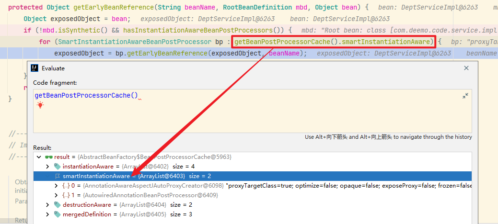
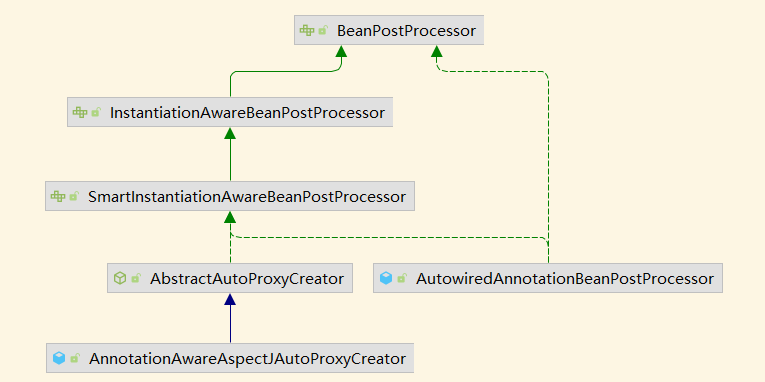
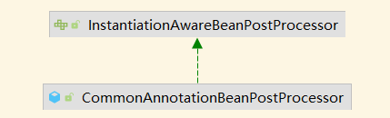
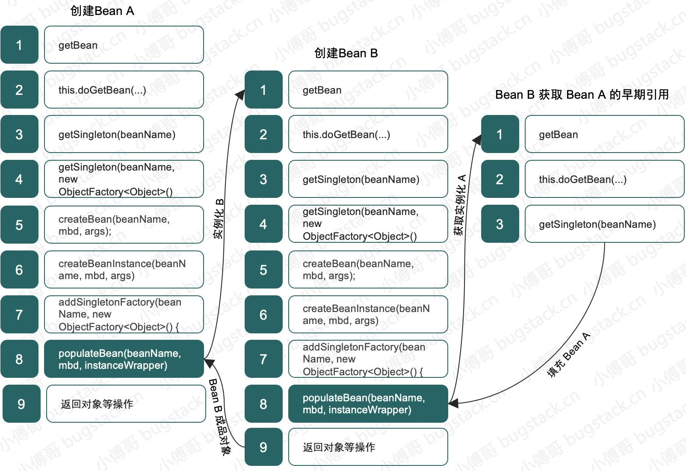
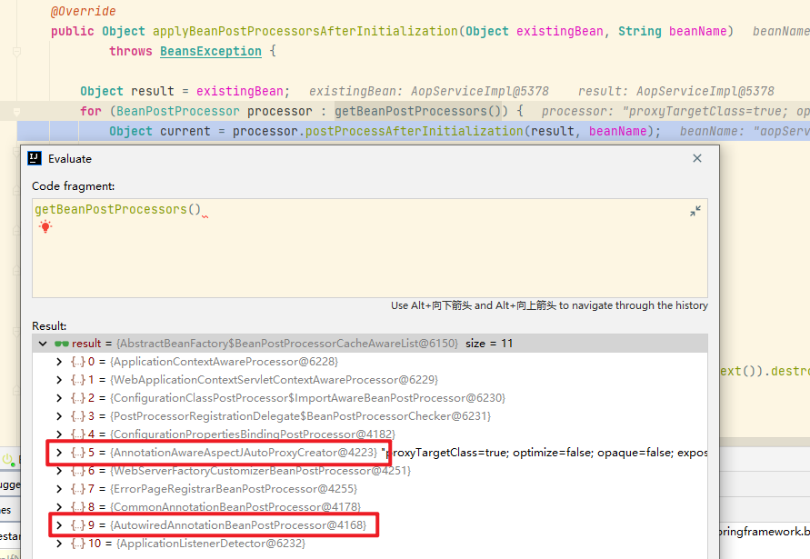

# Spring Code Learn

## 1. 三级缓存

通过类：`DefaultSingletonBeanRegistry` 缓存、获取Bean实例。

### 1.1 三级缓存分别对应以下三个属性

```java
/** Cache of singleton objects: bean name to bean instance. */
private final Map<String, Object> singletonObjects = new ConcurrentHashMap<>(256);

/** Cache of early singleton objects: bean name to bean instance. */
private final Map<String, Object> earlySingletonObjects = new ConcurrentHashMap<>(16);

/** Cache of singleton factories: bean name to ObjectFactory. */
private final Map<String, ObjectFactory<?>> singletonFactories = new HashMap<>(16);
```

### 1.2 从缓存中获取Bean

```java
/**
 * Return the (raw) singleton object registered under the given name.
 * <p>Checks already instantiated singletons and also allows for an early
 * reference to a currently created singleton (resolving a circular reference).
 * @param beanName the name of the bean to look for
 * @param allowEarlyReference whether early references should be created or not
 * @return the registered singleton object, or {@code null} if none found
 */
@Nullable
protected Object getSingleton(String beanName, boolean allowEarlyReference) {
    // Quick check for existing instance without full singleton lock
    // ① 从一级缓存中获取成品Bean
    Object singletonObject = this.singletonObjects.get(beanName);
    // 没获取到成品Bean，并且该Bean是否在创建中
    if (singletonObject == null && isSingletonCurrentlyInCreation(beanName)) {
        // ② 该Bean正在创建中，从二级缓存中获取Bean
        singletonObject = this.earlySingletonObjects.get(beanName);
        if (singletonObject == null && allowEarlyReference) {
            // 二级缓存中也没有获取到Bean，加锁从三级缓存（工厂）中获取
            synchronized (this.singletonObjects) {
                // Consistent creation of early reference within full singleton lock
                // *1* 双重判断保证线程安全
                singletonObject = this.singletonObjects.get(beanName);
                if (singletonObject == null) {
                    singletonObject = this.earlySingletonObjects.get(beanName);
                    // 从前两级缓存中均没有获取到Bean实例时
                    if (singletonObject == null) {
                        // ③ 从三级缓存中获取Bean
                        ObjectFactory<?> singletonFactory = 
                            this.singletonFactories.get(beanName);
                        if (singletonFactory != null) {
                            // *2* 三级缓存中存在，获取到工厂，通过工厂产生Bean实例
                            singletonObject = singletonFactory.getObject();
                            // 将获取到的Bean放置在二级缓存中，有且仅有这里会对二级缓存设置值
                            this.earlySingletonObjects.put(beanName, singletonObject);
                            // 从三级缓存中移除该Bean的缓存
                            this.singletonFactories.remove(beanName);
                        }
                    }
                }
            }
        }
    }
    return singletonObject;
}


/**
 * Return whether the specified singleton bean is currently in creation
 * (within the entire factory).
 * @param beanName the name of the bean
 */
public boolean isSingletonCurrentlyInCreation(String beanName) {
    return this.singletonsCurrentlyInCreation.contains(beanName);
}
```

① 处：在最上层缓存 `singletonObjects` 获取Bean，此时获取到的Bean是可直接使用的成品Bean，即已经注入过属性的Bean实例。

② 处：从二级缓存 `earlySingletonObjects` 中获取提前暴露的半成品Bean，此时获取到的Bean仅完成实例化，还未注入属性。**注意：从二级缓存获取Bean实例的条件之一为该Bean正在创建中！，该状态在2.2.4小节中进行设置。**

③ 处：从三级缓存 `singletonFactory` 中获取该Bean的工厂对象，通过工厂对象产生Bean实例或代理对象<sup>[1]</sup>。**注意：从三级缓存获取Bean实例的条件之一为传参：`allowEarlyReference = true`！**从三级缓存获取到工厂对象并生产Bean实例后，会将该Bean实例存放至二级缓存（**有且仅有这里会对二级缓存设置值**）中并从三级缓存中移除该Bean。

\*1\* 处：双重判断保证线程安全，在锁外进行了两次缓存查询操作，因此在锁内需要再进行同样两次缓存查询操作保证线程安全。

\*2\* 处：工厂对象实质是一个匿名内部类对象：`ObjectFactory`，在类 `AbstractAutowireCapableBeanFactory` 的`doCreateBean()` 方法中设置值（**实例化工厂对象时，Bean已经实例化了，但还未注入属性**）：

```java
protected Object doCreateBean(String beanName, RootBeanDefinition mbd, 
                              @Nullable Object[] args) throws BeanCreationException {
    // Instantiate the bean.
    BeanWrapper instanceWrapper = null;
    if (mbd.isSingleton()) {
        instanceWrapper = this.factoryBeanInstanceCache.remove(beanName);
    }
    if (instanceWrapper == null) {
        instanceWrapper = createBeanInstance(beanName, mbd, args);
    }
    Object bean = instanceWrapper.getWrappedInstance();
    
    // Eagerly cache singletons to be able to resolve circular references
    // even when triggered by lifecycle interfaces like BeanFactoryAware.
    boolean earlySingletonExposure = (mbd.isSingleton() && this.allowCircularReferences &&
                                      isSingletonCurrentlyInCreation(beanName));
    if (earlySingletonExposure) {
        // 缓存工厂对象，提前暴露，解决循环依赖问题，可以看到，此时Bean其实已经实例化了
        addSingletonFactory(beanName, () -> getEarlyBeanReference(beanName, mbd, bean));
    }
    
    // Initialize the bean instance...
}
```

### 1.3 第三级缓存生产Bean

#### 1.3.1 从第三级缓存获取Bean

```java
// 从三级缓存中获取Bean
ObjectFactory<?> singletonFactory = this.singletonFactories.get(beanName);
// *2* 三级缓存中存在，获取到工厂，通过工厂产生Bean实例
singletonObject = singletonFactory.getObject();
```

可以看到，从第三层缓存获取到的缓存对象是该Bean的**工厂对象**，而在上一小节可以发现，该工厂对象是在类 `AbstractAutowireCapableBeanFactory` 的`doCreateBean()` 方法中为Bean设置缓存值：工厂对象，**并且可以发现，在设置工厂对象缓存时，该工厂对象已经持有了实例化后的Bean（但还未注入属性）。为什么需要这样做？可以先思考一下。**

#### 1.3.2 工厂对象生产Bean

上文提到，**工厂对象已经持有了实例化的Bean**，为什么还需要通过工厂对象再包装一层呢？先来看一下 `ObjectFactory#getObject` 都做了什么。

##### 1.3.2.1 AbstractAutowireCapableBeanFactory#getEarlyBeanReference

```java
/**
 * Obtain a reference for early access to the specified bean,
 * typically for the purpose of resolving a circular reference.
 * @param beanName the name of the bean (for error handling purposes)
 * @param mbd the merged bean definition for the bean
 * @param bean the raw bean instance
 * @return the object to expose as bean reference
 */
protected Object getEarlyBeanReference(String beanName, RootBeanDefinition mbd, Object bean) {
    Object exposedObject = bean;
    if (!mbd.isSynthetic() && hasInstantiationAwareBeanPostProcessors()) {
        for (SmartInstantiationAwareBeanPostProcessor bp : 
             // 获取所有的 SmartInstantiationAwareBeanPostProcessor
             getBeanPostProcessorCache().smartInstantiationAware) {
            // 执行 getEarlyBeanReference 方法获取Bean
            exposedObject = bp.getEarlyBeanReference(exposedObject, beanName);
        }
    }
    return exposedObject;
}
```

`SmartInstantiationAwareBeanPostProcessor` 默认内置有俩：

##### 1.3.2.2 SmartInstantiationAwareBeanPostProcessor

来看看 `SmartInstantiationAwareBeanPostProcessor` 接口：

```java
/*
 * Copyright 2002-2016 the original author or authors.
 *
 * Licensed under the Apache License, Version 2.0 (the "License");
 * you may not use this file except in compliance with the License.
 * You may obtain a copy of the License at
 *
 *      https://www.apache.org/licenses/LICENSE-2.0
 *
 * Unless required by applicable law or agreed to in writing, software
 * distributed under the License is distributed on an "AS IS" BASIS,
 * WITHOUT WARRANTIES OR CONDITIONS OF ANY KIND, either express or implied.
 * See the License for the specific language governing permissions and
 * limitations under the License.
 */

package org.springframework.beans.factory.config;

import java.lang.reflect.Constructor;

import org.springframework.beans.BeansException;
import org.springframework.lang.Nullable;

/**
 * Extension of the {@link InstantiationAwareBeanPostProcessor} interface,
 * adding a callback for predicting the eventual type of a processed bean.
 *
 * <p><b>NOTE:</b> This interface is a special purpose interface, mainly for
 * internal use within the framework. In general, application-provided
 * post-processors should simply implement the plain {@link BeanPostProcessor}
 * interface or derive from the {@link InstantiationAwareBeanPostProcessorAdapter}
 * class. New methods might be added to this interface even in point releases.
 *
 * @author Juergen Hoeller
 * @since 2.0.3
 * @see InstantiationAwareBeanPostProcessorAdapter
 */
public interface SmartInstantiationAwareBeanPostProcessor extends InstantiationAwareBeanPostProcessor {

	/**
	 * Predict the type of the bean to be eventually returned from this
	 * processor's {@link #postProcessBeforeInstantiation} callback.
	 * <p>The default implementation returns {@code null}.
	 * @param beanClass the raw class of the bean
	 * @param beanName the name of the bean
	 * @return the type of the bean, or {@code null} if not predictable
	 * @throws org.springframework.beans.BeansException in case of errors
	 */
	@Nullable
	default Class<?> predictBeanType(Class<?> beanClass, String beanName) throws BeansException {
		return null;
	}

	/**
	 * Determine the candidate constructors to use for the given bean.
	 * <p>The default implementation returns {@code null}.
	 * @param beanClass the raw class of the bean (never {@code null})
	 * @param beanName the name of the bean
	 * @return the candidate constructors, or {@code null} if none specified
	 * @throws org.springframework.beans.BeansException in case of errors
	 */
	@Nullable
	default Constructor<?>[] determineCandidateConstructors(Class<?> beanClass, String beanName)
			throws BeansException {

		return null;
	}

	/**
	 * Obtain a reference for early access to the specified bean,
	 * typically for the purpose of resolving a circular reference.
	 * <p>This callback gives post-processors a chance to expose a wrapper
	 * early - that is, before the target bean instance is fully initialized.
	 * ****** 注意 ******
	 * The exposed object should be equivalent to the what
	 * {@link #postProcessBeforeInitialization} / {@link #postProcessAfterInitialization}
	 * would expose otherwise.
	 * ****** 注意 ******
     * Note that the object returned by this method will
	 * be used as bean reference unless the post-processor returns a different
	 * wrapper from said post-process callbacks. In other words: Those post-process
	 * callbacks may either eventually expose the same reference or alternatively
	 * return the raw bean instance from those subsequent callbacks (if the wrapper
	 * for the affected bean has been built for a call to this method already,
	 * it will be exposes as final bean reference by default).
	 * <p>The default implementation returns the given {@code bean} as-is.
	 * @param bean the raw bean instance
	 * @param beanName the name of the bean
	 * @return the object to expose as bean reference
	 * (typically with the passed-in bean instance as default)
	 * @throws org.springframework.beans.BeansException in case of errors
	 */
	default Object getEarlyBeanReference(Object bean, String beanName) throws BeansException {
		return bean;
	}

}
```

该接口有一个 `getEarlyBeanReference` 默认方法，默认实现为：接收一个Bean对象并返回该Bean对象，不做任何处理。该接口的默认实现有两个：`AnnotationAwareAspectJAutoProxyCreator` 与 `AutowiredAnnotationBeanPostProcessor`，其关系如下：

**可以看出，他们均是 `BeanPostProcessor`，我们着重关注一下 `AbstractAutoProxyCreator`。**

##### 1.3.2.3 AutowiredAnnotationBeanPostProcessor

`AutowiredAnnotationBeanPostProcessor` **并未重写 `getEarlyBeanReference` 方法**，所以不会对Bean对象做任何处理。

##### 1.3.2.4 AnnotationAwareAspectJAutoProxyCreator

`AnnotationAwareAspectJAutoProxyCreator` 也并未直接重写 `getEarlyBeanReference` 方法，而是其父类 `AbstractAutoProxyCreator` 重写了 `getEarlyBeanReference` 方法。

##### 1.3.2.5 AbstractAutoProxyCreator#getEarlyBeanReference

```java
@Override
public Object getEarlyBeanReference(Object bean, String beanName) {
    Object cacheKey = getCacheKey(bean.getClass(), beanName);
    // *1* 向中 earlyProxyReferences 存放原始Bean
    this.earlyProxyReferences.put(cacheKey, bean);
    return wrapIfNecessary(bean, beanName, cacheKey);
}


/**
 * Wrap the given bean if necessary, i.e. if it is eligible for being proxied.
 * @param bean the raw bean instance
 * @param beanName the name of the bean
 * @param cacheKey the cache key for metadata access
 * @return a proxy wrapping the bean, or the raw bean instance as-is
 */
protected Object wrapIfNecessary(Object bean, String beanName, Object cacheKey) {
    // ...
    
    // ① Create proxy if we have advice.
    Object[] specificInterceptors = getAdvicesAndAdvisorsForBean(bean.getClass(), beanName, null);
    if (specificInterceptors != DO_NOT_PROXY) {
        this.advisedBeans.put(cacheKey, Boolean.TRUE);
        // 创建代理对象
        Object proxy = createProxy(
                bean.getClass(), beanName, specificInterceptors, new SingletonTargetSource(bean));
        this.proxyTypes.put(cacheKey, proxy.getClass());
        return proxy;
    }

    this.advisedBeans.put(cacheKey, Boolean.FALSE);
    return bean;
}
```

① 处：判断是否需要创建代理对象。

小结：可以看出，通过第三季缓存获取到该Bean的工厂对象后，虽然工厂对象已经持有了已实例化的Bean，但并未直接返回该Bean对象，而是获取系统中的所有 `SmartInstantiationAwareBeanPostProcessor` 并遍历调用它们的 `getEarlyBeanReference` 方法对Bean实例进行增强，我们最常用到的功能便是AOP切面功能（代理技术）。`AnnotationAwareAspectJAutoProxyCreator` 的父类 `AbstractAutoProxyCreator` 重写了 `getEarlyBeanReference` 方法，**重写后的方法将判断当前系统是否需要创建代理对象对Bean进行增强**。此处三级缓存的作用后文再细讲。

## 2. 启动流程

### 2.1 Bean生命周期

Bean factory implementations should support the standard bean lifecycle interfaces as far as possible. The full set of initialization methods and their standard order is:

1. BeanNameAware's setBeanName
2. BeanClassLoaderAware's setBeanClassLoader
3. BeanFactoryAware's setBeanFactory
4. EnvironmentAware's setEnvironment
5. EmbeddedValueResolverAware's setEmbeddedValueResolver
6. ResourceLoaderAware's setResourceLoader (only applicable when running in an application context)
7. ApplicationEventPublisherAware's setApplicationEventPublisher (only applicable when running in an application context)
8. MessageSourceAware's setMessageSource (only applicable when running in an application context)
9. ApplicationContextAware's setApplicationContext (only applicable when running in an application context)
10. ServletContextAware's setServletContext (only applicable when running in a web application context)
11. postProcessBeforeInitialization methods of BeanPostProcessors
12. InitializingBean's afterPropertiesSet
13. a custom init-method definition
14. postProcessAfterInitialization methods of BeanPostProcessors

On shutdown of a bean factory, the following lifecycle methods apply:

1. postProcessBeforeDestruction methods of DestructionAwareBeanPostProcessors
2. DisposableBean's destroy
3. a custom destroy-method definition

### 2.2 初始化Bean

#### 2.2.1 Spring启动入口

```java
// org.springframework.context.support.AbstractApplicationContext#refresh
@Override
public void refresh() throws BeansException, IllegalStateException {
    // ...

    // Initialize other special beans in specific context subclasses.
    onRefresh();

    // Check for listener beans and register them.
    registerListeners();

    // Instantiate all remaining (non-lazy-init) singletons.
    // 初始化 Bean
    finishBeanFactoryInitialization(beanFactory);

    // Last step: publish corresponding event.
    finishRefresh();
    
    // ...
}
```

#### 2.2.2 DefaultListableBeanFactory#preInstantiateSingletons

```java
/**
 * Ensure that all non-lazy-init singletons are instantiated, also considering
 * {@link org.springframework.beans.factory.FactoryBean FactoryBeans}.
 * Typically invoked at the end of factory setup, if desired.
 * @throws BeansException if one of the singleton beans could not be created.
 * Note: This may have left the factory with some beans already initialized!
 * Call {@link #destroySingletons()} for full cleanup in this case.
 * @see #destroySingletons()
 */
public void preInstantiateSingletons() throws BeansException {
    // Iterate over a copy to allow for init methods which in turn register new bean definitions.
    // While this may not be part of the regular factory bootstrap, it does otherwise work fine.
    List<String> beanNames = new ArrayList<>(this.beanDefinitionNames);

    // Trigger initialization of all non-lazy singleton beans...
    for (String beanName : beanNames) {
        getBean(beanName);
    }
}
```

#### 2.2.3 AbstractBeanFactory#doGetBean

```java
/**
 * Return an instance, which may be shared or independent, of the specified bean.
 * @param name the name of the bean to retrieve
 * @param requiredType the required type of the bean to retrieve
 * @param args arguments to use when creating a bean instance using explicit arguments
 * (only applied when creating a new instance as opposed to retrieving an existing one)
 * @param typeCheckOnly whether the instance is obtained for a type check,
 * not for actual use
 * @return an instance of the bean
 * @throws BeansException if the bean could not be created
 */
protected <T> T doGetBean(String name, @Nullable Class<T> requiredType, 
                          @Nullable Object[] args, 
                          boolean typeCheckOnly) throws BeansException {
    // Eagerly check singleton cache for manually registered singletons.
    // ① 从缓存中获取Bean实例
    Object sharedInstance = getSingleton(beanName);
    
    // dependsOn...
    
    if (mbd.isSingleton()) {
        // 获取单例Bean，lambda 表达式构造 ObjectFactory
        sharedInstance = getSingleton(beanName, () -> {
            try {
                // 创建Bean实例
                return createBean(beanName, mbd, args);
            } catch (BeansException ex) {
                // Explicitly remove instance from singleton cache: It might have been put there
                // eagerly by the creation process, to allow for circular reference resolution.
                // Also remove any beans that received a temporary reference to the bean.
                destroySingleton(beanName);
                throw ex;
            }
        });
        beanInstance = getObjectForBeanInstance(sharedInstance, name, beanName, mbd);
    }
    
    // ...
}

@Override
@Nullable
public Object getSingleton(String beanName) {
    return getSingleton(beanName, true);
}
```

**① 处：从缓存中获取Bean实例（代码见1.2小节），便是从这里利用三层缓存解决循环依赖的问题。这里第二个参数：`allowEarlyReference` 便是 `true`。**

`allowEarlyReference = true` 时，表示如果该Bean正在创建中，则从第三级缓存中获取该Bean的工厂对象，使用工厂对象生产Bean实例。

#### 2.2.4 DefaultSingletonBeanRegistry#getSingleton

```java
/**
 * Return the (raw) singleton object registered under the given name,
 * creating and registering a new one if none registered yet.
 * @param beanName the name of the bean
 * @param singletonFactory the ObjectFactory to lazily create the singleton
 * with, if necessary
 * @return the registered singleton object
 */
public Object getSingleton(String beanName, ObjectFactory<?> singletonFactory) {
    // 加锁、保证单例
    synchronized (this.singletonObjects) {
        Object singletonObject = this.singletonObjects.get(beanName);
        // 再次尝试从一级缓存中获取，获取不到则进行初始化
        if (singletonObject == null) {
            // ① 标记当前Bean正在创建中
            beforeSingletonCreation(beanName);
            
            try {
                // ② 调用前一步 lambda 创建的匿名内部类对象创建Bean实例
                singletonObject = singletonFactory.getObject();
            } finally {
                // ③ 创建完成，移除正在创建状态
                afterSingletonCreation(beanName);                
            }
            
            // ④ 将Bean添加到一级缓存中并从其余两级缓存中移除
            addSingleton(beanName, singletonObject);
        }
    }
}


/**
 * Callback before singleton creation.
 * <p>The default implementation register the singleton as currently in creation.
 * @param beanName the name of the singleton about to be created
 * @see #isSingletonCurrentlyInCreation
 */
protected void beforeSingletonCreation(String beanName) {
    // 标记该Bean正在创建中
    if (!this.inCreationCheckExclusions.contains(beanName) && 
        !this.singletonsCurrentlyInCreation.add(beanName)) {
        throw new BeanCurrentlyInCreationException(beanName);
    }
}

/**
 * Callback after singleton creation.
 * <p>The default implementation marks the singleton as not in creation anymore.
 * @param beanName the name of the singleton that has been created
 * @see #isSingletonCurrentlyInCreation
 */
protected void afterSingletonCreation(String beanName) {
    // 将该Bean从正在创建状态移除
    if (!this.inCreationCheckExclusions.contains(beanName) && 
        !this.singletonsCurrentlyInCreation.remove(beanName)) {
        throw new IllegalStateException("Singleton '" + beanName + "' isn't currently in creation");
    }
}


/**
 * Add the given singleton object to the singleton cache of this factory.
 * <p>To be called for eager registration of singletons.
 * @param beanName the name of the bean
 * @param singletonObject the singleton object
 */
protected void addSingleton(String beanName, Object singletonObject) {
    synchronized (this.singletonObjects) {
        // 添加该成品Bean至一级缓存中，已经是可直接使用状态
        this.singletonObjects.put(beanName, singletonObject);
        // 从三级缓存中移除
        this.singletonFactories.remove(beanName);
        // 从二级缓存中移除
        this.earlySingletonObjects.remove(beanName);
        this.registeredSingletons.add(beanName);
    }
}
```

① 处：标记该Bean正在创建中，

#### 2.2.5 AbstractAutowireCapableBeanFactory#createBean

```java
/**
 * Central method of this class: creates a bean instance,
 * populates the bean instance, applies post-processors, etc.
 * @see #doCreateBean
 */
@Override
protected Object createBean(String beanName, RootBeanDefinition mbd, @Nullable Object[] args)
    throws BeanCreationException {
    Object beanInstance = doCreateBean(beanName, mbdToUse, args);
    return beanInstance;
}
```

#### 2.2.6 AbstractAutowireCapableBeanFactory#doCreateBean

> 真正创建Bean实例的地方。

```java
/**
 * Actually create the specified bean. Pre-creation processing has already happened
 * at this point, e.g. checking {@code postProcessBeforeInstantiation} callbacks.
 * <p>Differentiates between default bean instantiation, use of a
 * factory method, and autowiring a constructor.
 * @param beanName the name of the bean
 * @param mbd the merged bean definition for the bean
 * @param args explicit arguments to use for constructor or factory method invocation
 * @return a new instance of the bean
 * @throws BeanCreationException if the bean could not be created
 * @see #instantiateBean
 * @see #instantiateUsingFactoryMethod
 * @see #autowireConstructor
 */
protected Object doCreateBean(String beanName, RootBeanDefinition mbd, @Nullable Object[] args) throws BeanCreationException {

    // Instantiate the bean.
    // ① 真正实例化Bean对象处
	BeanWrapper instanceWrapper = createBeanInstance(beanName, mbd, args);
    Object bean = instanceWrapper.getWrappedInstance();
    
    // Eagerly cache singletons to be able to resolve circular references
    // even when triggered by lifecycle interfaces like BeanFactoryAware.
    boolean earlySingletonExposure = (mbd.isSingleton() && this.allowCircularReferences &&
                                      isSingletonCurrentlyInCreation(beanName));
    if (earlySingletonExposure) {
        // ② 提前暴露实例到第三层缓存中，使用 lambda 表达式创建 ObjectFactory 工厂对象
        addSingletonFactory(beanName, () -> getEarlyBeanReference(beanName, mbd, bean));
    }
    
    // Initialize the bean instance.
    Object exposedObject = bean;
    try {
        // ③ 注入属性，循环依赖便出现在这里
        populateBean(beanName, mbd, instanceWrapper);
        // ④ 对Bean实例进行后置处理增强
        exposedObject = initializeBean(beanName, exposedObject, mbd);
    } catch () {}

    if (earlySingletonExposure) {
        // ⑤ 检查处理，从缓存中检查增强后的处理、循环依赖后的处理
        Object earlySingletonReference = getSingleton(beanName, false);
        if (earlySingletonReference != null) {
            // 约定大于配置，后置增强应该返回同样的Bean
            if (exposedObject == bean) {
                exposedObject = earlySingletonReference;
            } else if (!this.allowRawInjectionDespiteWrapping && hasDependentBean(beanName)) {
                String[] dependentBeans = getDependentBeans(beanName);
                Set<String> actualDependentBeans = new LinkedHashSet<>(dependentBeans.length);
                for (String dependentBean : dependentBeans) {
                    if (!removeSingletonIfCreatedForTypeCheckOnly(dependentBean)) {
                        actualDependentBeans.add(dependentBean);
                    }
                }
                if (!actualDependentBeans.isEmpty()) {
                    // 推断异常，同一个类产生了多个对象
                    throw new BeanCurrentlyInCreationException();
                }
            }
        }
    }
}


/**
 * Obtain a reference for early access to the specified bean,
 * typically for the purpose of resolving a circular reference.
 * @param beanName the name of the bean (for error handling purposes)
 * @param mbd the merged bean definition for the bean
 * @param bean the raw bean instance
 * @return the object to expose as bean reference
 */
protected Object getEarlyBeanReference(String beanName, RootBeanDefinition mbd, Object bean) {
    Object exposedObject = bean;
    if (!mbd.isSynthetic() && hasInstantiationAwareBeanPostProcessors()) {
        for (SmartInstantiationAwareBeanPostProcessor bp : getBeanPostProcessorCache().smartInstantiationAware) {
            exposedObject = bp.getEarlyBeanReference(exposedObject, beanName);
        }
    }
    return exposedObject;
}
```

① 处：利用反射，创建Bean实例，在非构造器注入属性的情况下，此时创建的Bean还未注入属性。

② 处：将已创建的Bean实例使用 `ObjectFactory` 工厂对象提前暴露在第三级缓存中，用以解决循环依赖问题。

③ 处：对该Bean实例进行属性注入，这里便是循环依赖出现的现场入口。

④ 处：对该Bean进行后置增强操作，例如AOP代理。

⑤ 处：从缓存中获取Bean实例进行**检查**，注意第二个参数为：`false`！从1.2小节可知第二个参数为 `false` 时，表示只从一级和二级缓存中获取Bean实例。

### 2.3 注入属性

#### 2.3.1 AbstractAutowireCapableBeanFactory#populateBean

```java
/**
 * Populate the bean instance in the given BeanWrapper with the property values
 * from the bean definition.
 * @param beanName the name of the bean
 * @param mbd the bean definition for the bean
 * @param bw the BeanWrapper with bean instance
 */
@SuppressWarnings("deprecation")  // for postProcessPropertyValues
protected void populateBean(String beanName, RootBeanDefinition mbd,
                            @Nullable BeanWrapper bw) {
    for (InstantiationAwareBeanPostProcessor bp : 
         getBeanPostProcessorCache().instantiationAware) {
        // 入口
        PropertyValues pvsToUse = 
            bp.postProcessProperties(pvs, bw.getWrappedInstance(), beanName);
    }
}
```

#### 2.3.2 CommonAnnotationBeanPostProcessor#postProcessProperties

```java
@Override
public PropertyValues postProcessProperties(PropertyValues pvs, 
                                            Object bean, String beanName) {
    // 获取需要注入的属性列表，被封装在 InjectionMetadata 对象中
    InjectionMetadata metadata = findResourceMetadata(beanName, bean.getClass(), pvs);
    try {
        // 调用该对象的注入入口
        metadata.inject(bean, beanName, pvs);
    } catch () {}
    return pvs;
}
```

#### 2.3.3 InjectionMetadata#inject

```java
public void inject(Object target, @Nullable String beanName, 
                   @Nullable PropertyValues pvs) throws Throwable {
    // 获取需要注入的属性列表
    Collection<InjectedElement> checkedElements = this.checkedElements;
    Collection<InjectedElement> elementsToIterate =
        (checkedElements != null ? checkedElements : this.injectedElements);
    // 需要注入的属性列表不为空时
    if (!elementsToIterate.isEmpty()) {
        // 遍历属性列表进行属性注入
        for (InjectedElement element : elementsToIterate) {
            element.inject(target, beanName, pvs);
        }
    }
}
```

#### 2.3.4 InjectedElement#inject

```java
/**
 * Either this or {@link #getResourceToInject} needs to be overridden.
 */
protected void inject(Object target, @Nullable String requestingBeanName, 
                      @Nullable PropertyValues pvs) throws Throwable {
    if (this.isField) {
        Field field = (Field) this.member;
        ReflectionUtils.makeAccessible(field);
        // 对该属性字段赋值
        field.set(target, getResourceToInject(target, requestingBeanName));
    }
}
```

#### 2.3.5 CommonAnnotationBeanPostProcessor#getResourceToInject&getResource

```java
@Override
protected Object getResourceToInject(Object target, @Nullable String requestingBeanName) {
    return (this.lazyLookup ? buildLazyResourceProxy(this, requestingBeanName) :
            // 非 lazy
            getResource(this, requestingBeanName));
}


/**
 * Obtain the resource object for the given name and type.
 * @param element the descriptor for the annotated field/method
 * @param requestingBeanName the name of the requesting bean
 * @return the resource object (never {@code null})
 * @throws NoSuchBeanDefinitionException if no corresponding target resource found
 */
protected Object getResource(LookupElement element, @Nullable String requestingBeanName)
    throws NoSuchBeanDefinitionException {

    if (StringUtils.hasLength(element.mappedName)) {
        return this.jndiFactory.getBean(element.mappedName, element.lookupType);
    }
    if (this.alwaysUseJndiLookup) {
        return this.jndiFactory.getBean(element.name, element.lookupType);
    }
    if (this.resourceFactory == null) {
        throw new NoSuchBeanDefinitionException(element.lookupType, "No resource factory configured - specify the 'resourceFactory' property");
    }
    
    // 获取注入属性的Bean实例，resourceFactory 默认为 DefaultListableBeanFactory
    return autowireResource(this.resourceFactory, element, requestingBeanName);
}
```

#### 2.3.6 CommonAnnotationBeanPostProcessor#autowireResource

```java
/**
 * Obtain a resource object for the given name and type through autowiring
 * based on the given factory.
 * @param factory the factory to autowire against
 * @param element the descriptor for the annotated field/method
 * @param requestingBeanName the name of the requesting bean
 * @return the resource object (never {@code null})
 * @throws NoSuchBeanDefinitionException if no corresponding target resource found
 */
protected Object autowireResource(BeanFactory factory, 
                                  LookupElement element, @Nullable String requestingBeanName) 
    throws NoSuchBeanDefinitionException {

    Object resource;
    // beanFactory 即 DefaultListableBeanFactory
    resource = beanFactory.resolveDependency(descriptor, requestingBeanName, autowiredBeanNames, null);
    
    return resource;
}
```

#### 2.3.7 DefaultListableBeanFactory#resolveDependency

```java
@Override
@Nullable
public Object resolveDependency(DependencyDescriptor descriptor, 
                                @Nullable String requestingBeanName, 
                                @Nullable Set<String> autowiredBeanNames, 
                                @Nullable TypeConverter typeConverter) throws BeansException {
    // ...
    
    Object result = getAutowireCandidateResolver().getLazyResolutionProxyIfNecessary(
        descriptor, requestingBeanName);
    if (result == null) {
        // 非 lazy，执行获取注入属性（依赖属性）Bean实例操作
        result = doResolveDependency(descriptor, requestingBeanName, autowiredBeanNames, typeConverter);
    }
    return result;
    
    // ...
}
```

#### 2.3.8 DefaultListableBeanFactory#doResolveDependency

```java
@Nullable
public Object doResolveDependency(DependencyDescriptor descriptor,
                                  @Nullable String beanName,
                                  @Nullable Set<String> autowiredBeanNames,
                                  @Nullable TypeConverter typeConverter) 
    throws BeansException {

    // ...
    
    // DependencyDescriptor
    instanceCandidate = descriptor.resolveCandidate(autowiredBeanName, type, this);
    
    // ...
}
```

#### 2.3.9 DependencyDescriptor#resolveCandidate

```java
/**
 * Resolve the specified bean name, as a candidate result of the matching
 * algorithm for this dependency, to a bean instance from the given factory.
 * <p>The default implementation calls {@link BeanFactory#getBean(String)}.
 * Subclasses may provide additional arguments or other customizations.
 * @param beanName the bean name, as a candidate result for this dependency
 * @param requiredType the expected type of the bean (as an assertion)
 * @param beanFactory the associated factory
 * @return the bean instance (never {@code null})
 * @throws BeansException if the bean could not be obtained
 * @since 4.3.2
 * @see BeanFactory#getBean(String)
 */
public Object resolveCandidate(String beanName, Class<?> requiredType, 
                               BeanFactory beanFactory) throws BeansException {

    return beanFactory.getBean(beanName);
}
```

#### 2.3.10 AbstractBeanFactory#getBean

```java
@Override
public Object getBean(String name) throws BeansException {
    return doGetBean(name, null, null, false);
}
```

#### 2.3.11 AbstractBeanFactory#doGetBean

**此时则回到了初始化Bean的第三步，形成递归调用。**

```java
protected <T> T doGetBean(String name, @Nullable Class<T> requiredType, 
                          @Nullable Object[] args, 
                          boolean typeCheckOnly) throws BeansException {
    // ...
}
```

### 2.4 后置处理器增强 - BeanPostProcessor

> 后置处理器增强是在Bean完成实例化、且属性已经注入完毕之后进行（特殊情况除外（循环依赖））。
>
> **后置增强的典型应用便是：AOP切面技术。**
>
> 入口便是2.2.6小节中：`exposedObject = initializeBean(beanName, exposedObject, mbd);`

#### 2.4.1 BeanPostProcessor

```java

/**
 * Factory hook that allows for custom modification of new bean instances &mdash;
 * for example, checking for marker interfaces or wrapping beans with proxies.
 *
 * <p>Typically, post-processors that populate beans via marker interfaces
 * or the like will implement {@link #postProcessBeforeInitialization},
 * while post-processors that wrap beans with proxies will normally
 * implement {@link #postProcessAfterInitialization}.
 *
 * <h3>Registration</h3>
 * <p>An {@code ApplicationContext} can autodetect {@code BeanPostProcessor} beans
 * in its bean definitions and apply those post-processors to any beans subsequently
 * created. A plain {@code BeanFactory} allows for programmatic registration of
 * post-processors, applying them to all beans created through the bean factory.
 *
 * <h3>Ordering</h3>
 * <p>{@code BeanPostProcessor} beans that are autodetected in an
 * {@code ApplicationContext} will be ordered according to
 * {@link org.springframework.core.PriorityOrdered} and
 * {@link org.springframework.core.Ordered} semantics. In contrast,
 * {@code BeanPostProcessor} beans that are registered programmatically with a
 * {@code BeanFactory} will be applied in the order of registration; any ordering
 * semantics expressed through implementing the
 * {@code PriorityOrdered} or {@code Ordered} interface will be ignored for
 * programmatically registered post-processors. Furthermore, the
 * {@link org.springframework.core.annotation.Order @Order} annotation is not
 * taken into account for {@code BeanPostProcessor} beans.
 *
 * @author Juergen Hoeller
 * @author Sam Brannen
 * @since 10.10.2003
 * @see InstantiationAwareBeanPostProcessor
 * @see DestructionAwareBeanPostProcessor
 * @see ConfigurableBeanFactory#addBeanPostProcessor
 * @see BeanFactoryPostProcessor
 */
public interface BeanPostProcessor {

	/**
	 * Apply this {@code BeanPostProcessor} to the given new bean instance <i>before</i> any bean
	 * initialization callbacks (like InitializingBean's {@code afterPropertiesSet}
	 * or a custom init-method). The bean will already be populated with property values.
	 * The returned bean instance may be a wrapper around the original.
	 * <p>The default implementation returns the given {@code bean} as-is.
	 * @param bean the new bean instance
	 * @param beanName the name of the bean
	 * @return the bean instance to use, either the original or a wrapped one;
	 * if {@code null}, no subsequent BeanPostProcessors will be invoked
	 * @throws org.springframework.beans.BeansException in case of errors
	 * @see org.springframework.beans.factory.InitializingBean#afterPropertiesSet
	 */
	@Nullable
	default Object postProcessBeforeInitialization(Object bean, String beanName) throws BeansException {
		return bean;
	}

	/**
	 * Apply this {@code BeanPostProcessor} to the given new bean instance <i>after</i> any bean
	 * initialization callbacks (like InitializingBean's {@code afterPropertiesSet}
	 * or a custom init-method). The bean will already be populated with property values.
	 * The returned bean instance may be a wrapper around the original.
	 * <p>In case of a FactoryBean, this callback will be invoked for both the FactoryBean
	 * instance and the objects created by the FactoryBean (as of Spring 2.0). The
	 * post-processor can decide whether to apply to either the FactoryBean or created
	 * objects or both through corresponding {@code bean instanceof FactoryBean} checks.
	 * <p>This callback will also be invoked after a short-circuiting triggered by a
	 * {@link InstantiationAwareBeanPostProcessor#postProcessBeforeInstantiation} method,
	 * in contrast to all other {@code BeanPostProcessor} callbacks.
	 * <p>The default implementation returns the given {@code bean} as-is.
	 * @param bean the new bean instance
	 * @param beanName the name of the bean
	 * @return the bean instance to use, either the original or a wrapped one;
	 * if {@code null}, no subsequent BeanPostProcessors will be invoked
	 * @throws org.springframework.beans.BeansException in case of errors
	 * @see org.springframework.beans.factory.InitializingBean#afterPropertiesSet
	 * @see org.springframework.beans.factory.FactoryBean
	 */
	@Nullable
	default Object postProcessAfterInitialization(Object bean, String beanName) throws BeansException {
		return bean;
	}

}
```

`BeanPostProcessor` 接口提供两个接口：

1. `postProcessBeforeInitialization`
2. `postProcessAfterInitialization`

#### 2.4.2 AbstractAutowireCapableBeanFactory#initializeBean

```java
/**
 * Initialize the given bean instance, applying factory callbacks
 * as well as init methods and bean post processors.
 * <p>Called from {@link #createBean} for traditionally defined beans,
 * and from {@link #initializeBean} for existing bean instances.
 * @param beanName the bean name in the factory (for debugging purposes)
 * @param bean the new bean instance we may need to initialize
 * @param mbd the bean definition that the bean was created with
 * (can also be {@code null}, if given an existing bean instance)
 * @return the initialized bean instance (potentially wrapped)
 * @see BeanNameAware
 * @see BeanClassLoaderAware
 * @see BeanFactoryAware
 * @see #applyBeanPostProcessorsBeforeInitialization
 * @see #invokeInitMethods
 * @see #applyBeanPostProcessorsAfterInitialization
 */
protected Object initializeBean(String beanName, Object bean, @Nullable RootBeanDefinition mbd) {
    if (System.getSecurityManager() != null) {
        AccessController.doPrivileged((PrivilegedAction<Object>) () -> {
            invokeAwareMethods(beanName, bean);
            return null;
        }, getAccessControlContext());
    }
    else {
        invokeAwareMethods(beanName, bean);
    }

    Object wrappedBean = bean;
    if (mbd == null || !mbd.isSynthetic()) {
        // before
        wrappedBean = applyBeanPostProcessorsBeforeInitialization(wrappedBean, beanName);
    }

    try {
        invokeInitMethods(beanName, wrappedBean, mbd);
    }
    catch (Throwable ex) {
        throw new BeanCreationException(
            (mbd != null ? mbd.getResourceDescription() : null),
            beanName, "Invocation of init method failed", ex);
    }
    if (mbd == null || !mbd.isSynthetic()) {
        // after
        wrappedBean = applyBeanPostProcessorsAfterInitialization(wrappedBean, beanName);
    }

    return wrappedBean;
}

```

#### 2.4.3 AbstractAutowireCapableBeanFactory#applyBeanPostProcessorsBeforeInitialization

```java
@Override
public Object applyBeanPostProcessorsBeforeInitialization(Object existingBean, String beanName)
    throws BeansException {

    Object result = existingBean;
    for (BeanPostProcessor processor : getBeanPostProcessors()) {
        // 触发 postProcessBeforeInitialization
        Object current = processor.postProcessBeforeInitialization(result, beanName);
        if (current == null) {
            return result;
        }
        result = current;
    }
    return result;
}
```

#### 2.4.4 AbstractAutowireCapableBeanFactory#applyBeanPostProcessorsAfterInitialization

```java
@Override
public Object applyBeanPostProcessorsAfterInitialization(Object existingBean, String beanName)
    throws BeansException {

    Object result = existingBean;
    for (BeanPostProcessor processor : getBeanPostProcessors()) {
        // 触发 postProcessAfterInitialization
        Object current = processor.postProcessAfterInitialization(result, beanName);
        if (current == null) {
            return result;
        }
        result = current;
    }
    return result;
}
```

## 3. 循环依赖

> 完整串一遍Bean实例化过程中，三级缓存是如何解决循环依赖问题的。

### 3.1 场景假设

存在两个Service：ServiceA、ServiceB，两个Service互相持有对方。

### 3.2 Bean实例化过程

1. 从缓存中获取Bean ServiceA，`allowEarlyReference = true`
2. 由于ServiceA是第一次实例化，该Bean不在创建中，所以只从一级缓存中获取Bean实例（小节1.2），当然此时获取不到，所以进行**Bean实例化**操作
3. Bean ServiceA实例化前，标记Bean ServiceA正在创建中
4. Bean ServiceA实例化中：
   1. 实例化Bean ServiceA，此时Service A的属性都为零值（还未属性注入）
   2. **将Bean ServiceA放置在三级缓存中提前暴露**
   3. 对Bean ServiceA进行属性注入，属性注入流程中检查出需要注入的属性有：ServiceB
      1. 从2.2.3小节可知，最终会进行递归调用对需要注入的属性进行实例化，因此又回到第1步：从缓存中获取Bean ServiceB，`allowEarlyReference = true`
      2. 由于ServiceB是第一次实例化，**该Bean不在创建中**，所以只从一级缓存中获取Bean实例（小节1.2），当然此时获取不到，所以进行**Bean实例化**操作
      3. Bean ServiceB实例化前，标记Bean ServiceB正在创建中
      4. Bean ServiceB实例化中：
         1. 实例化Bean ServiceB，此时Service B的属性都为零值（还未属性注入）
         2. **将Bean ServiceB放置在三级缓存中提前暴露**
         3. 对Bean ServiceB进行属性注入，属性注入流程中检查出需要注入的属性有：ServiceA
            1. 从2.2.3小节可知，最终会进行递归调用对需要注入的属性进行实例化，因此又回到第1步：从缓存中获取Bean ServiceA，`allowEarlyReference = true`
            2. 由于ServiceA已经实例化过且已标记Bean ServiceA正在创建中，因此先从一二级缓存中获取Bean ServiceA实例是否存在，但获取不到
            3. 由于参数：`allowEarlyReference = true`，因此将从第三级缓存中获取Bean ServiceA实例，由于Bean ServiceA已经提前暴露，因此可以获取到该Bean ServiceA工厂对象缓存，此时将通过ServiceA的**工厂对象生产Bean实例并放置在二级缓存中，见1.3小节**，再从三级缓存中移除Bean ServiceA的缓存
            4. 获取到Bean ServiceA实例，递归返回退出
         4. 对Bean ServiceB进行后置处理增强，见2.4小节
         5. **检查处理**，保证属性注入后的Bean和当前Bean必须是同一个Bean
      5. Bean ServiceB实例化后，将Bean ServiceB从创建中状态移除
      6. 此时得到的Bean已经是成品Bean，可直接使用，并将Bean ServiceB存放至一级缓存中并从二三级缓存中移除
      7. 返回Bean ServiceB
   4. 对Bean ServiceA进行后置处理增强，见2.4小节
   5. **检查处理**，保证属性注入后的Bean和当前Bean必须是同一个Bean
5. Bean ServiceA实例化后，将Bean ServiceA从创建中状态移除
6. 此时得到的Bean已经是成品Bean，可直接使用，并将Bean ServiceA存放至一级缓存中并从二三级缓存中移除
7. 返回Bean ServiceA

图片引用自：https://www.zhihu.com/question/438247718/answer/1730527725

### 3.3 后置增强补充

通过前文我们知道，后置增强补充即是遍历调用所有 `BeanPostProcessor` 的 `applyBeanPostProcessorsBeforeInitialization` 和 `applyBeanPostProcessorsAfterInitialization` 方法对Bean实例进行增强，而在1.3.2.2小节提到过，`SmartInstantiationAwareBeanPostProcessor` 的实现也是 `BeanPostProcessor`，而其中的 `AnnotationAwareAspectJAutoProxyCreator` 会为Bean创建代理对象，那么在进行正常的后置处理器增强过程中，会重复创建代理对象吗？怎么保证单例的？

此处作者故意再检查了一下后置处理器增强处理逻辑中将会遍历的 `BeanPostProcessor` 列表，确保之前三级缓存中的两个 `BeanPostProcessor` 仍然存在：

回顾一下 `AbstractAutoProxyCreator`：

```java
/**
 * Create a proxy with the configured interceptors if the bean is
 * identified as one to proxy by the subclass.
 * @see #getAdvicesAndAdvisorsForBean
 */
@Override
// BeanPostProcessor 后置处理器的接口方法之一
public Object postProcessAfterInitialization(@Nullable Object bean, String beanName) {
    if (bean != null) {
        // 生成该Bean的缓存key
        Object cacheKey = getCacheKey(bean.getClass(), beanName);
        // ① 检查 earlyProxyReferences 是否存在与当前Bean不同的对象
        if (this.earlyProxyReferences.remove(cacheKey) != bean) {
            // 不存在时，调用wrap过程
            return wrapIfNecessary(bean, beanName, cacheKey);
        }
    }
    return bean;
}
```

① 处：可以发现，在对Bean进行增强处理前，判断在 `earlyProxyReferences` 中是否存在与当前Bean不同的对象，当存在（**空或存在不相同的对象**）时才进行增强处理（创建代理对象），而 `earlyProxyReferences` 是在哪里存放值的呢？bingo，**仅在调用 `getEarlyBeanReference` 方法时**，会将原始Bean存放至 `earlyProxyReferences` 中，**而 `getEarlyBeanReference` 又在第三级缓存生产Bean实例时被调用（见1.3.2.5小节）**，此时便完整的串了起来：

1. 第三级缓存在循环依赖时被调用生产Bean
2. 第三季缓存生产Bean时将调用 `AbstractAutoProxyCreator` 的 `getEarlyBeanReference` 方法生成Bean
3. `getEarlyBeanReference` 方法首先将原始Bean存放至 `earlyProxyReferences` 中，再调用 `wrapIfNecessary` 方法对Bean进行增强（创建代理对象）
4. 循环依赖的处理流程：AB互相持有，首先初始化A -> 注入属性B -> 属性B还未创建，递归初始化B -> 注入属性A -> 属性A在创建中，从三级缓存中获取A的工厂对象生产A -> 生产A时首先将A的原始对象存放至 `earlyProxyReferences` 中，再对Bean A进行增强处理 -> 返回**增强后（代理对象）的Bean A**，对B进行后置处理增强 -> 返回**增强后（代理对象）的Bean B**（退出递归） -> 对A进行后置处理增强 -> `earlyProxyReferences` 中已经存在原始Bean A，因此不再进行 `AbstractAutoProxyCreator` 的后置处理 -> **返回原始Bean A**
5. 嗯？一个是返回的**增强后（代理对象）的Bean B**，一个返回的是**原始Bean A**？

###  3.4 检查处理是什么？

检查处理、检查处理，文中多次提到检查处理，那2.2.6小节中的检查处理代码有什么作用？

在上一小节的结尾，我么遗留了一个问题：Bean B返回的是增强后的对象，而Bean A却返回的是原始对象？细想一下，肯定不对啊，在循环依赖处理流程中，我们明明生产了**增强后（代理对象）的Bean A**，且对Bean B注入的也是增强后的Bean A，为什么最后返回的却是原始Bean A呢？单例环境却同时出现了**增强后（代理对象）的Bean A**和**原始Bean A**，不符合单例原则，有问题！

有问题就得解决，问题出现在最后，最后退出时返回的Bean A应该是**增强后（代理对象）的Bean A**而不是原始Bean A，从Spring源码结构来看，**① 实例化对象、② 属性注入、③ 后置增强、④ 返回实例对象**在同一层次，最后返回的Bean是①被③后置增强处理后的Bean对象，而之前也说过，循环依赖时将有第三级缓存中的工厂对象提前创建代理对象，而在后续的后置处理增强时不能再进行后置增强再产生一个新的代理对象，那样就违反了单例原则！

回顾 `AbstractAutowireCapableBeanFactory#doCreateBean`

```java
protected Object doCreateBean(String beanName, RootBeanDefinition mbd, @Nullable Object[] args) throws BeanCreationException {
    
    // ...
    
    // Eagerly cache singletons to be able to resolve circular references
    // even when triggered by lifecycle interfaces like BeanFactoryAware.
    boolean earlySingletonExposure = (mbd.isSingleton() && this.allowCircularReferences &&
                                      isSingletonCurrentlyInCreation(beanName));

    // ...
    
    if (earlySingletonExposure) {
        // ⑤ 检查处理，从缓存中检查增强后的处理、循环依赖后的处理
        Object earlySingletonReference = getSingleton(beanName, false);
        if (earlySingletonReference != null) {
            // 约定大于配置，后置增强应该返回同样的Bean
            if (exposedObject == bean) {
                // ⑥ 将当前对象替换为从缓存中获取到的对象
                exposedObject = earlySingletonReference;
            } else if (!this.allowRawInjectionDespiteWrapping && hasDependentBean(beanName)) {
                String[] dependentBeans = getDependentBeans(beanName);
                Set<String> actualDependentBeans = new LinkedHashSet<>(dependentBeans.length);
                for (String dependentBean : dependentBeans) {
                    if (!removeSingletonIfCreatedForTypeCheckOnly(dependentBean)) {
                        actualDependentBeans.add(dependentBean);
                    }
                }
                if (!actualDependentBeans.isEmpty()) {
                    // 推断异常，同一个类产生了多个对象
                    throw new BeanCurrentlyInCreationException();
                }
            }
        }
    }
    
    // ...
}
```

⑤ 处：**第二个参数为：`false`**，从1.2小节可知第二个参数为 `false` 时，表示只从一级和二级缓存中获取Bean实例。一级缓存中存放的是可直接使用的成品Bean，仅在Bean初始化结束后Bean才会被放置在一级缓存中，因此一级缓存中存在Bend实例时，除非是非循环依赖。而从1.2小节可知，仅由第三级缓存生产的Bean实例会被放置在耳机缓存中，从1.3.2小节和3.3小节可知，第三级缓存的工厂对象在生产Bean时，将提前对Bean进行部分后置增强（`SmartInstantiationAwareBeanPostProcessor`），其中就包括创建**代理对象**，因此**从二级缓存中获取到的对象要么是原始对象、要么是代理对象**。

⑥ 处：将当前对象替换为从缓存中获取到的对象，**从二级缓存中获取到的对象要么是原始对象、要么是代理对象**，替换后最终返回的Bean实例便是被注入到其他Bean实例属性中的对象（原始对象或代理对象），便保证了是单例模式。

### 3.5 三级缓存？一二级缓存行不行？

从开发经验和个人感觉来说，其实**二级缓存就已经能解决循环依赖**的问题了，甚至一级缓存也能解决循环依赖，但为什么需要三级缓存呢？

从上文可以看出，第三级缓存的作用是当出现循环依赖时，从第三级缓存中获取工厂对象生产Benn实例，并且我们已知其实工厂对象已经持有了Bean实例！**当没有开启AOP时，工厂对象便直接返回原始Bean实例；当开启了AOP时，工厂对象的另一个作用便是提前调用后置处理器对Bean实例增强（AOP代理对象）**，并且当开启AOP时，**每次调用工厂对象均会生产一个新的代理对象**，于是便可以看到1.2小节中：工厂对象一生产Bean实例后，立马将该实例存放至二级缓存中，并从第三级缓存中移除该工厂对象。编者认为这也算是三级缓存存在的原因之一。

编者认为三级缓存存在的更重要的原因是：**不愿意违背Spring的Bean的生命周期与AOP结合的设计。**当理解前文的铺垫后，很容易看出：Spring结合AOP跟Bean的生命周期本身就是通过 `AnnotationAwareAspectJAutoProxyCreator` 这个后置处理器来完成的，在这个后置处理的 `postProcessAfterInitialization` 方法中对初始化后的Bean完成AOP代理。如果出现了循环依赖，那没有办法，只有给Bean先创建代理，但是没有出现循环依赖的情况下，**设计之初就是让Bean在生命周期的最后一步完成代理而不是在实例化后就立马完成代理**。

关于循环依赖时，提前进行后置处理对Bean进行增强，在 `SmartInstantiationAwareBeanPostProcessor` 中的`getEarlyBeanReference` 方法注释上，Spring也已经明确表示：The exposed object should be equivalent to the what `postProcessBeforeInitialization` / `postProcessAfterInitialization` would expose otherwise. 在源码分析我们也看到Spring确实遵守了该约定（见3.3小节和3.4小节）。

