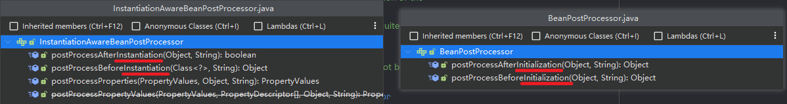
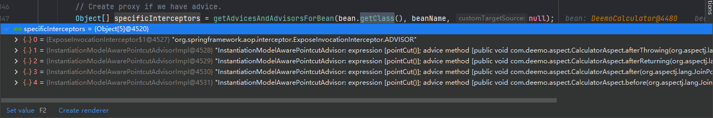
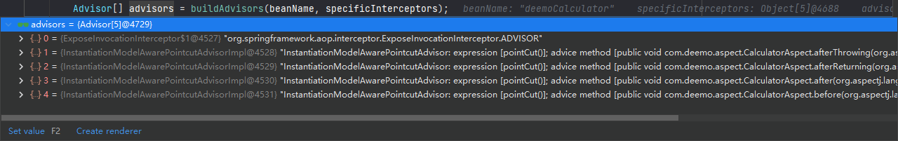
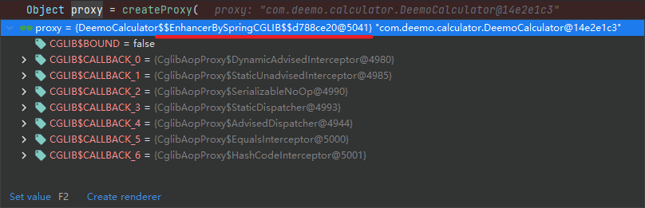
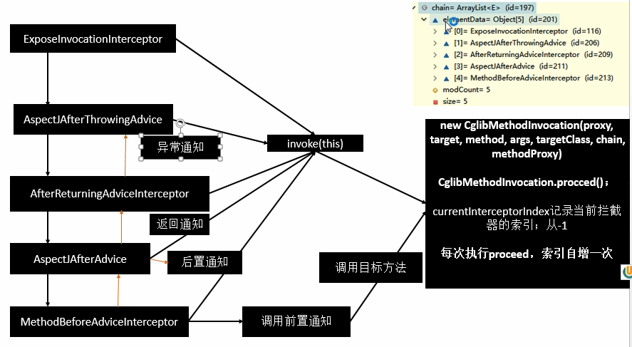

# Albrus - Spring AOP

> Understanding and learning of aop in spring framework.

## 一、引入依赖

```xml
<dependencies>
    <!--Spring框架核心库 -->
    <dependency>
      <groupId>org.springframework</groupId>
      <artifactId>spring-context</artifactId>
      <version>${spring.version}</version>
    </dependency>

    <!-- Spring Web -->
    <!--<dependency>
      <groupId>org.springframework</groupId>
      <artifactId>spring-web</artifactId>
      <version>${spring.version}</version>
    </dependency>-->

    <!-- Spring Web MVC，会自动引入其他 Spring 依赖（spring-context + spring-web），包括 Spring AOP -->
    <!--<dependency>
        <groupId>org.springframework</groupId>
        <artifactId>spring-webmvc</artifactId>
        <version>${spring.version}</version>
    </dependency>-->

    <!-- spring-context 会引入 spring-aop -->
    <!--<dependency>
      <groupId>org.springframework</groupId>
      <artifactId>spring-aop</artifactId>
      <version>${spring.version}</version>
    </dependency>-->

    <!-- 会自动引入 aspectjweaver -->
    <dependency>
      <groupId>org.springframework</groupId>
      <artifactId>spring-aspects</artifactId>
      <version>${spring.version}</version>
    </dependency>

    <!-- import org.aspectj.lang.annotation.Aspect 用于 @Aspect -->
    <!--<dependency>
      <groupId>org.aspectj</groupId>
      <artifactId>aspectjrt</artifactId>
      <version>${aspectjrt.version}</version>
    </dependency>-->

    <!-- aspectJ AOP 织入器 Aspect 的依赖包 -->
    <!-- <dependency>
      <groupId>org.aspectj</groupId>
      <artifactId>aspectjweaver</artifactId>
      <version>${aspectj.version}</version>
    </dependency>-->
</dependencies>
```

思考：`spring-aop`、`spring-aspects`、和 `aspectj` 三者是什么关系？

## 二、食用方式

### 2.1 开启AOP

1. 配置文件

   ```xml
   <?xml version="1.0" encoding="UTF-8"?>
   <beans xmlns="http://www.springframework.org/schema/beans"
          xmlns:xsi="http://www.w3.org/2001/XMLSchema-instance"
          xmlns:context="http://www.springframework.org/schema/context"
          xmlns:aop="http://www.springframework.org/schema/aop"
          xsi:schemaLocation="http://www.springframework.org/schema/beans
           http://www.springframework.org/schema/beans/spring-beans.xsd
           http://www.springframework.org/schema/context
           http://www.springframework.org/schema/context/spring-context.xsd
           http://www.springframework.org/schema/aop
           http://www.springframework.org/schema/context/spring-aop.xsd">
   
       <!-- 开启基于注解版的切面工程 -->
       <aop:aspectj-autoproxy/>
   </beans>
   ```

2. 基于注解

   ```java
   @Configuration
   // 开启 AOP
   @EnableAspectJAutoProxy
   public class App {...}
   ```

### 2.2 食用

```java
// 告诉 Spring 是一个 Aspect 类
@Aspect
public class CalculatorAspect {

    /**
     * 抽取公共切入点
     */
    @Pointcut("execution(public * com.deemo.calculator.DeemoCalculator.*(..))")
    public void pointCut() {}

    @Before("pointCut()")
    // @Before("public * com.deemo.calculator.DeemoCalculator.*(..)")
    public void before(JoinPoint point) {
        log.info("Method: {} before exec, the args are: {}.", this.getFullMethodName(point), point.getArgs());
    }

    @After("pointCut()")
    public void after(JoinPoint point) {
        String name = point.getSignature().getDeclaringTypeName() + "#" + point.getSignature().getName();
        log.info("Method: {} after exec...", this.getFullMethodName(point));
    }

    @AfterReturning(value = "pointCut()", returning = "result")
    public void afterReturning(JoinPoint point, Object result) {
        log.info("Method: {} after returning, the return is: {}.", this.getFullMethodName(point), result);
    }

    @AfterThrowing(value = "pointCut()", throwing = "e")
    public void afterThrowing(JoinPoint point, Exception e) {
        log.info("Method: {} after throwing, the exception is: {}!", this.getFullMethodName(point), e);
    }

    private String getFullMethodName(JoinPoint point) {
        return point.getSignature().getDeclaringTypeName() + "#" + point.getSignature().getName();
    }

}
```

1. 配置类上声明开启AOP：`@EnableAspectJAutoProxy`
2. 切面类声明：`@Aspect public class CalculatorAspect {...}`
3. 切入点声明：`@Pointcut("execution(public * com.deemo.calculator.DeemoCalculator.*(..))")`

## 三、AOP 原理

### 3.1 `@EnableAspectJAutoProxy`

1. `EnableAspectJAutoProxy` 是什么：

   ```java
   @Import(AspectJAutoProxyRegistrar.class)
   public @interface EnableAspectJAutoProxy {...}
   ```

   给容器导入了一个：`AspectJAutoProxyRegistrar`

2. `AspectJAutoProxyRegistrar.class` 是什么：

   ```java
   // 是一个 ImportBeanDefinitionRegistrar 接口的实现
   class AspectJAutoProxyRegistrar implements ImportBeanDefinitionRegistrar {
   
   	/**
   	 * Register, escalate, and configure the AspectJ auto proxy creator based on the value
   	 * of the @{@link EnableAspectJAutoProxy#proxyTargetClass()} attribute on the importing
   	 * {@code @Configuration} class.
   	 */
   	@Override
   	public void registerBeanDefinitions(AnnotationMetadata importingClassMetadata, BeanDefinitionRegistry registry) {
   
           // 为容器导入Bean
   		AopConfigUtils.registerAspectJAnnotationAutoProxyCreatorIfNecessary(registry);
   
   		AnnotationAttributes enableAspectJAutoProxy = AnnotationConfigUtils.attributesFor(importingClassMetadata, EnableAspectJAutoProxy.class);
   		if (enableAspectJAutoProxy != null) {
               // ...
   			if (enableAspectJAutoProxy.getBoolean("proxyTargetClass")) {
   				AopConfigUtils.forceAutoProxyCreatorToUseClassProxying(registry);
   			}
               // ...
   			if (enableAspectJAutoProxy.getBoolean("exposeProxy")) {
   				AopConfigUtils.forceAutoProxyCreatorToExposeProxy(registry);
   			}
   		}
   	}
   
   }
   ```

   可以看到，`AspectJAutoProxyRegistrar` 其实是一个 `ImportBeanDefinitionRegistrar` 接口的实现类，接口方法实现中指定了为容器导入Bean逻辑：`AopConfigUtils.registerAspectJAnnotationAutoProxyCreatorIfNecessary(registry);`

3. 导入逻辑实现是怎样的：

   ```java
   // org.springframework.aop.config.AopConfigUtils
   private static final List<Class<?>> APC_PRIORITY_LIST = new ArrayList<>(3);
   
   static {
       // Set up the escalation list...
       APC_PRIORITY_LIST.add(InfrastructureAdvisorAutoProxyCreator.class);
       APC_PRIORITY_LIST.add(AspectJAwareAdvisorAutoProxyCreator.class);
       APC_PRIORITY_LIST.add(AnnotationAwareAspectJAutoProxyCreator.class);
   }
   
   // org.springframework.aop.config.AopConfigUtils#registerOrEscalateApcAsRequired
   private static BeanDefinition registerOrEscalateApcAsRequired(
       Class<?> cls, BeanDefinitionRegistry registry, @Nullable Object source) {
   
       Assert.notNull(registry, "BeanDefinitionRegistry must not be null");
   
       // 判断容器中是否已经有了
       if (registry.containsBeanDefinition(AUTO_PROXY_CREATOR_BEAN_NAME)) {
           BeanDefinition apcDefinition = registry.getBeanDefinition(AUTO_PROXY_CREATOR_BEAN_NAME);
           if (!cls.getName().equals(apcDefinition.getBeanClassName())) {
               // 获取容器中该Bean的优先级，优先级即是在 APC_PRIORITY_LIST 的下标索引
               int currentPriority = findPriorityForClass(apcDefinition.getBeanClassName());
               // 获取当前Bean的优先级
               int requiredPriority = findPriorityForClass(cls);
               // 索引越大越优先，替换
               if (currentPriority < requiredPriority) {
                   apcDefinition.setBeanClassName(cls.getName());
               }
           }
           return null;
       }
   
       // 注册 AnnotationAwareAspectJAutoProxyCreator
       RootBeanDefinition beanDefinition = new RootBeanDefinition(cls);
       beanDefinition.setSource(source);
       beanDefinition.getPropertyValues().add("order", Ordered.HIGHEST_PRECEDENCE);
       beanDefinition.setRole(BeanDefinition.ROLE_INFRASTRUCTURE);
       registry.registerBeanDefinition(AUTO_PROXY_CREATOR_BEAN_NAME, beanDefinition);
       return beanDefinition;
   }
   ```

   1. `cls = AnnotationAwareAspectJAutoProxyCreator.class`

   2. `AUTO_PROXY_CREATOR_BEAN_NAME = "org.springframework.aop.config.internalAutoProxyCreator"`

   3. 当容器中还没有 `internalAutoProxyCreator` Bean时，添加 `AnnotationAwareAspectJAutoProxyCreator.class`

   4. 当容器中有了 `internalAutoProxyCreator` Bean时，判断优先级（即是在 APC_PRIORITY_LIST 的下标索引），优先级更高的将替换原来的Bean

      ```java
      // Set up the escalation list...
      APC_PRIORITY_LIST.add(InfrastructureAdvisorAutoProxyCreator.class);
      APC_PRIORITY_LIST.add(AspectJAwareAdvisorAutoProxyCreator.class);
      APC_PRIORITY_LIST.add(AnnotationAwareAspectJAutoProxyCreator.class);
      ```

   5. 发现其实便是为容器注入了一个 `AnnotationAwareAspectJAutoProxyCreator.class`

4. `AnnotationAwareAspectJAutoProxyCreator.class` 是什么？

   ```java
   AnnotationAwareAspectJAutoProxyCreator
       -> extends AspectJAwareAdvisorAutoProxyCreator
           -> extends AbstractAdvisorAutoProxyCreator
               -> extends AbstractAutoProxyCreator
                   -> implements SmartInstantiationAwareBeanPostProcessor, BeanFactoryAware
   ```

   ==重点关注：`SmartInstantiationAwareBeanPostProcessor, BeanFactoryAware`，后置处理器（Bean初始化完成前后执行的业务）和自动装配 `BeanFactory`==

### 3.2 分析 `AnnotationAwareAspectJAutoProxyCreator`

从上往下分析与 `BeanPostProcessor` 和 `BeanFactoryAware` 有关的点：

1. `AbstractAutoProxyCreator`

   1. `AbstractAutoProxyCreator#setBeanFactory`
   2. `AbstractAutoProxyCreator#postProcessBeforeInstantiation`
   3. `AbstractAutoProxyCreator#postProcessAfterInitialization`

2. `AbstractAdvisorAutoProxyCreator`

   1. `AbstractAdvisorAutoProxyCreator#setBeanFactory`

      重写 `setBeanFactory` 方法，内部将会**追加**调用：`AbstractAdvisorAutoProxyCreator#initBeanFactory`

3. `AnnotationAwareAspectJAutoProxyCreator`

   1. `AnnotationAwareAspectJAutoProxyCreator#initBeanFactory`

      重写 `initBeanFactory` 方法

总结：

1. 在 `AbstractAutoProxyCreator` 中有后置处理器和Bean工厂逻辑
2. 在 `AbstractAdvisorAutoProxyCreator` 中重写了 `setBeanFactory` 方法，追加调用 `initBeanFactory` 方法
3. 在 `AnnotationAwareAspectJAutoProxyCreator` 中重写了 `initBeanFactory` 方法

### 3.3 注册 `AnnotationAwareAspectJAutoProxyCreator`

1. 在 `refresh()` 的 `registerBeanPostProcessors(beanFactory);` 阶段，为容器注册创建Bean时的拦截器

   ```java
   // org.springframework.context.support.AbstractApplicationContext#refresh
   public void refresh() throws BeansException, IllegalStateException {
       synchronized (this.startupShutdownMonitor) {
           // Prepare this context for refreshing.
           prepareRefresh();
   
           // Tell the subclass to refresh the internal bean factory.
           ConfigurableListableBeanFactory beanFactory = obtainFreshBeanFactory();
   
           // Prepare the bean factory for use in this context.
           prepareBeanFactory(beanFactory);
   
           try {
               // Allows post-processing of the bean factory in context subclasses.
               postProcessBeanFactory(beanFactory);
   
               // Invoke factory processors registered as beans in the context.
               invokeBeanFactoryPostProcessors(beanFactory);
   
               // Register bean processors that intercept bean creation.
               registerBeanPostProcessors(beanFactory);
               
               // ...
           }
       }
   ```

2. 注册 `BeanPostProcessors`，`AnnotationAwareAspectJAutoProxyCreator` 是 `Ordered` 实现类

   ```java
   public static void registerBeanPostProcessors(
       ConfigurableListableBeanFactory beanFactory, AbstractApplicationContext applicationContext) {
   
       String[] postProcessorNames = beanFactory.getBeanNamesForType(BeanPostProcessor.class, true, false);
   
       // Register BeanPostProcessorChecker that logs an info message when
       // a bean is created during BeanPostProcessor instantiation, i.e. when
       // a bean is not eligible for getting processed by all BeanPostProcessors.
       int beanProcessorTargetCount = beanFactory.getBeanPostProcessorCount() + 1 + postProcessorNames.length;
       beanFactory.addBeanPostProcessor(new BeanPostProcessorChecker(beanFactory, beanProcessorTargetCount));
   
       // Separate between BeanPostProcessors that implement PriorityOrdered,
       // Ordered, and the rest.
       // ==== 1. 按优先级分离 BeanPostProcessors
       List<BeanPostProcessor> priorityOrderedPostProcessors = new ArrayList<>();
       List<BeanPostProcessor> internalPostProcessors = new ArrayList<>();
       List<String> orderedPostProcessorNames = new ArrayList<>();
       List<String> nonOrderedPostProcessorNames = new ArrayList<>();
       for (String ppName : postProcessorNames) {
           // PriorityOrdered > Ordered > non
       }
   
       // First, register the BeanPostProcessors that implement PriorityOrdered.
       sortPostProcessors(priorityOrderedPostProcessors, beanFactory);
       registerBeanPostProcessors(beanFactory, priorityOrderedPostProcessors);
   
       // Next, register the BeanPostProcessors that implement Ordered.
       List<BeanPostProcessor> orderedPostProcessors = new ArrayList<>();
       for (String ppName : orderedPostProcessorNames) {
           // ==== 2. AnnotationAwareAspectJAutoProxyCreator 是 Ordered 实现类
           BeanPostProcessor pp = beanFactory.getBean(ppName, BeanPostProcessor.class);
           orderedPostProcessors.add(pp);
           if (pp instanceof MergedBeanDefinitionPostProcessor) {
               internalPostProcessors.add(pp);
           }
       }
       sortPostProcessors(orderedPostProcessors, beanFactory);
       // ==== 3. 注册 BeanPostProcessors 到 BeanFactory 中
       registerBeanPostProcessors(beanFactory, orderedPostProcessors);
   
       // Now, register all regular BeanPostProcessors.
       List<BeanPostProcessor> nonOrderedPostProcessors = new ArrayList<>();
       for (String ppName : nonOrderedPostProcessorNames) {
           BeanPostProcessor pp = beanFactory.getBean(ppName, BeanPostProcessor.class);
           nonOrderedPostProcessors.add(pp);
           if (pp instanceof MergedBeanDefinitionPostProcessor) {
               internalPostProcessors.add(pp);
           }
       }
       registerBeanPostProcessors(beanFactory, nonOrderedPostProcessors);
   
       // Finally, re-register all internal BeanPostProcessors.
       sortPostProcessors(internalPostProcessors, beanFactory);
       registerBeanPostProcessors(beanFactory, internalPostProcessors);
   
       // Re-register post-processor for detecting inner beans as ApplicationListeners,
       // moving it to the end of the processor chain (for picking up proxies etc).
       beanFactory.addBeanPostProcessor(new ApplicationListenerDetector(applicationContext));
   }
   ```

   1. 按 `PriorityOrdered > Ordered > non` 优先级分离 `BeanPostProcessors`，`AnnotationAwareAspectJAutoProxyCreator` 是 `Ordered` 实现类

   2. `BeanPostProcessor pp = beanFactory.getBean(ppName, BeanPostProcessor.class);` 创建 `BeanPostProcessor` 实例

      1. 进入 `org.springframework.beans.factory.support.AbstractBeanFactory#doGetBean` 获取/创建 Bean 接口创建 `BeanPostProcessor` 实例

      2. 在 `populateBean（属性赋值）` 之后的 `initializeBean` 阶段，执行 `invokeAwareMethods` 方法，触发 `Aware` 组件相关接口方法，而 `AnnotationAwareAspectJAutoProxyCreator` 恰好是 `BeanFactoryAware` 组件

         ```java
         // org.springframework.beans.factory.support.AbstractAutowireCapableBeanFactory#initializeBean
         // aware 组件接口方法
         invokeAwareMethods(beanName, bean);
         // BeforeInitialization postProcessBeforeInitialization
         wrappedBean = applyBeanPostProcessorsBeforeInitialization(wrappedBean, beanName);
         // InitMethods init-methods
         invokeInitMethods(beanName, wrappedBean, mbd);
         // AfterInitialization postProcessAfterInitialization
         wrappedBean = applyBeanPostProcessorsAfterInitialization(wrappedBean, beanName);
         ```

      3. 执行 `BeanFactoryAware` 的 `setBeanFactory` 接口方法

         ```java
         // org.springframework.aop.framework.autoproxy.AbstractAdvisorAutoProxyCreator#setBeanFactory
         public void setBeanFactory(BeanFactory beanFactory) {
             // 设置 beanFactory
             super.setBeanFactory(beanFactory);
             // 钩子函数，被 AnnotationAwareAspectJAutoProxyCreator 重写过
             initBeanFactory((ConfigurableListableBeanFactory) beanFactory);
         }
         ```

      4. `AnnotationAwareAspectJAutoProxyCreator#initBeanFactory`

         ```java
         // org.springframework.aop.aspectj.annotation.AnnotationAwareAspectJAutoProxyCreator#initBeanFactory
         protected void initBeanFactory(ConfigurableListableBeanFactory beanFactory) {
             super.initBeanFactory(beanFactory);
             if (this.aspectJAdvisorFactory == null) {
                 // 工厂
                 this.aspectJAdvisorFactory = new ReflectiveAspectJAdvisorFactory(beanFactory);
             }
             // 工厂建造器
             this.aspectJAdvisorsBuilder =
                 new BeanFactoryAspectJAdvisorsBuilderAdapter(beanFactory, this.aspectJAdvisorFactory);
         }
         
         // org.springframework.aop.framework.autoproxy.AbstractAdvisorAutoProxyCreator#initBeanFactory
         // super.initBeanFactory(beanFactory);
         protected void initBeanFactory(ConfigurableListableBeanFactory beanFactory) {
             this.advisorRetrievalHelper = new BeanFactoryAdvisorRetrievalHelperAdapter(beanFactory);
         }
         ```

         1. 创建 `advisorRetrievalHelper`
         2. 创建 `aspectJAdvisorFactory`
         3. 创建 `aspectJAdvisorsBuilder`

   3. 注册 `BeanPostProcessors` 到 `BeanFactory` 中

      ```java
      // org.springframework.context.support.PostProcessorRegistrationDelegate#registerBeanPostProcessors
      private static void registerBeanPostProcessors(
          ConfigurableListableBeanFactory beanFactory, List<BeanPostProcessor> postProcessors) {
          for (BeanPostProcessor postProcessor : postProcessors) {
              beanFactory.addBeanPostProcessor(postProcessor);
              // -> this.beanPostProcessors.add(beanPostProcessor);
          }
      }
      ```

      添加到 `AbstractBeanFactory.beanPostProcessors(CopyOnWriteArrayList<BeanPostProcessor>)` 中，==是一个 `CopyOnWriteArrayList`==

### 3.4 `AnnotationAwareAspectJAutoProxyCreator` 执行时机

> 注意：`AnnotationAwareAspectJAutoProxyCreator` 是一个 `SmartInstantiationAwareBeanPostProcessor` 后置处理器，更上层其实是一个：`InstantiationAwareBeanPostProcessor`，与前篇教程的后置处理器 `BeanPostProcessor` 不是同一个（详情参见章节四）：

#### 3.4.1 `InstantiationAwareBeanPostProcessor.postProcessBeforeInstantiation`

在 `AbstractAutoProxyCreator#postProcessBeforeInstantiation` 方法中，目前均返回 NULL，暂时不深究。

#### 3.4.2 `BeanPostProcessor.postProcessAfterInitialization`

在 `AbstractAutoProxyCreator#postProcessAfterInitialization` 方法中，存在一个 `wrapIfNecessary` 逻辑：

```java
// org.springframework.aop.framework.autoproxy.AbstractAutoProxyCreator#postProcessAfterInitialization
public Object postProcessAfterInitialization(@Nullable Object bean, String beanName) {
    if (bean != null) {
        Object cacheKey = getCacheKey(bean.getClass(), beanName);
        // 与循环依赖和三级缓存相关
        if (this.earlyProxyReferences.remove(cacheKey) != bean) {
            // 如果有必要，包装原始Bean
            return wrapIfNecessary(bean, beanName, cacheKey);
        }
    }
    return bean;
}
```

`wrapIfNecessary`：

```java
// org.springframework.aop.framework.autoproxy.AbstractAutoProxyCreator#wrapIfNecessary
/**
 * Wrap the given bean if necessary, i.e. if it is eligible for being proxied.
 * @param bean the raw bean instance
 * @param beanName the name of the bean
 * @param cacheKey the cache key for metadata access
 * @return a proxy wrapping the bean, or the raw bean instance as-is
 */
protected Object wrapIfNecessary(Object bean, String beanName, Object cacheKey) {
    if (StringUtils.hasLength(beanName) && this.targetSourcedBeans.contains(beanName)) {
        return bean;
    }
    if (Boolean.FALSE.equals(this.advisedBeans.get(cacheKey))) {
        return bean;
    }
    // 1. 判断是否是“基础代理”类型、判断是否有 `@Aspect` 注解
    if (isInfrastructureClass(bean.getClass()) || shouldSkip(bean.getClass(), beanName)) {
        this.advisedBeans.put(cacheKey, Boolean.FALSE);
        return bean;
    }

    // Create proxy if we have advice.
    // 2. 计算是否有切面可以切入该Bean实例
    Object[] specificInterceptors = getAdvicesAndAdvisorsForBean(bean.getClass(), beanName, null);
    if (specificInterceptors != DO_NOT_PROXY) {
        // 3. 如果可以被切入,标记并创建代理对象
        this.advisedBeans.put(cacheKey, Boolean.TRUE);
        Object proxy = createProxy(
            bean.getClass(), beanName, specificInterceptors, new SingletonTargetSource(bean));
        this.proxyTypes.put(cacheKey, proxy.getClass());
        return proxy;
    }

    this.advisedBeans.put(cacheKey, Boolean.FALSE);
    return bean;
}
```

1. 判断是否是“基础代理”类型、判断是否有 `@Aspect` 注解

   ```java
   // org.springframework.aop.aspectj.annotation.AnnotationAwareAspectJAutoProxyCreator#isInfrastructureClass
   return Advice.class.isAssignableFrom(beanClass) ||
       Pointcut.class.isAssignableFrom(beanClass) ||
       Advisor.class.isAssignableFrom(beanClass) ||
       AopInfrastructureBean.class.isAssignableFrom(beanClass);
   
   return (AnnotationUtils.findAnnotation(clazz, Aspect.class) != null);
   ```

2. 计算是否有切面可以切入该Bean实例

   ```java
   // org.springframework.aop.framework.autoproxy.AbstractAdvisorAutoProxyCreator#findEligibleAdvisors
   /**
    * Find all eligible Advisors for auto-proxying this class.
    * @param beanClass the clazz to find advisors for
    * @param beanName the name of the currently proxied bean
    * @return the empty List, not {@code null},
    * if there are no pointcuts or interceptors
    * @see #findCandidateAdvisors
    * @see #sortAdvisors
    * @see #extendAdvisors
    */
   protected List<Advisor> findEligibleAdvisors(Class<?> beanClass, String beanName) {
       // 找到所有的增强器
       List<Advisor> candidateAdvisors = findCandidateAdvisors();
       // 找到可以切入该Bean的增强器
       List<Advisor> eligibleAdvisors = findAdvisorsThatCanApply(candidateAdvisors, beanClass, beanName);
       // 扩展
       extendAdvisors(eligibleAdvisors);
       if (!eligibleAdvisors.isEmpty()) {
           // 增强器排序
           eligibleAdvisors = sortAdvisors(eligibleAdvisors);
       }
       return eligibleAdvisors;
   }
   ```

3. 如果可以被切入,标记并创建代理对象

   ```java
   // org.springframework.aop.framework.autoproxy.AbstractAutoProxyCreator#createProxy
   /**
    * Create an AOP proxy for the given bean.
    * @param beanClass the class of the bean
    * @param beanName the name of the bean
    * @param specificInterceptors the set of interceptors that is
    * specific to this bean (may be empty, but not null)
    * @param targetSource the TargetSource for the proxy,
    * already pre-configured to access the bean
    * @return the AOP proxy for the bean
    * @see #buildAdvisors
    */
   protected Object createProxy(Class<?> beanClass, @Nullable String beanName,
                                @Nullable Object[] specificInterceptors, TargetSource targetSource) {
   
       if (this.beanFactory instanceof ConfigurableListableBeanFactory) {
           AutoProxyUtils.exposeTargetClass((ConfigurableListableBeanFactory) this.beanFactory, beanName, beanClass);
       }
   
       // 1. 创建代理工厂
       ProxyFactory proxyFactory = new ProxyFactory();
       proxyFactory.copyFrom(this);
   
       if (!proxyFactory.isProxyTargetClass()) {
           if (shouldProxyTargetClass(beanClass, beanName)) {
               proxyFactory.setProxyTargetClass(true);
           }
           else {
               evaluateProxyInterfaces(beanClass, proxyFactory);
           }
       }
   
       // 2. 构建所有增强器
       Advisor[] advisors = buildAdvisors(beanName, specificInterceptors);
       proxyFactory.addAdvisors(advisors);
       proxyFactory.setTargetSource(targetSource);
       customizeProxyFactory(proxyFactory);
   
       proxyFactory.setFrozen(this.freezeProxy);
       if (advisorsPreFiltered()) {
           proxyFactory.setPreFiltered(true);
       }
   
       // 3. 通过代理工厂创建代理对象
       return proxyFactory.getProxy(getProxyClassLoader());
   }
   ```

   1. 创建代理工厂，由代理工厂完成代理对象创建

   2. 构建所有增强器

   3. 通过代理工厂创建代理对象

      1. `proxyFactory.getProxy(getProxyClassLoader());`

         ```java
         // org.springframework.aop.framework.ProxyFactory#getProxy(java.lang.ClassLoader)
         /**
          * Create a new proxy according to the settings in this factory.
          * <p>Can be called repeatedly. Effect will vary if we've added
          * or removed interfaces. Can add and remove interceptors.
          * <p>Uses the given class loader (if necessary for proxy creation).
          * @param classLoader the class loader to create the proxy with
          * (or {@code null} for the low-level proxy facility's default)
          * @return the proxy object
          */
         public Object getProxy(@Nullable ClassLoader classLoader) {
             return createAopProxy().getProxy(classLoader);
         }
         ```

      2. 其中会先创建 `AopProxy` 对象，由 `AopProxy` 创建代理对象

         - 创建 `AopProxy` 对象

           ```java
           // org.springframework.aop.framework.ProxyCreatorSupport#createAopProxy
           /**
            * Subclasses should call this to get a new AOP proxy. They should <b>not</b>
            * create an AOP proxy with {@code this} as an argument.
            */
           protected final synchronized AopProxy createAopProxy() {
               if (!this.active) {
                   activate();
               }
               return getAopProxyFactory().createAopProxy(this);
           }
           ```

         - `getAopProxyFactory()` 由 `AopProxyFactory` 创建 `AopProxy` 对象

           ```java
           // org.springframework.aop.framework.ProxyCreatorSupport#getAopProxyFactory
           public AopProxyFactory getAopProxyFactory() {
               return this.aopProxyFactory;
           }
           ```

         - `this.aopProxyFactory`

           ```java
           public class ProxyCreatorSupport extends AdvisedSupport {
           	private AopProxyFactory aopProxyFactory;
               
               public ProxyCreatorSupport() {
           		this.aopProxyFactory = new DefaultAopProxyFactory();
           	}
           }
           ```

           默认便是：`DefaultAopProxyFactory` 创建 `AopProxy` 对象

      3. 通过 `DefaultAopProxyFactory` 创建 `AopProxy` 对象

         ```java
         // org.springframework.aop.framework.DefaultAopProxyFactory
         public class DefaultAopProxyFactory implements AopProxyFactory, Serializable {
         
         	@Override
         	public AopProxy createAopProxy(AdvisedSupport config) throws AopConfigException {
         		if (config.isOptimize() || config.isProxyTargetClass() || hasNoUserSuppliedProxyInterfaces(config)) {
         			Class<?> targetClass = config.getTargetClass();
         			if (targetClass == null) {
         				throw new AopConfigException("TargetSource cannot determine target class: " +
         						"Either an interface or a target is required for proxy creation.");
         			}
         			if (targetClass.isInterface() || Proxy.isProxyClass(targetClass)) {
                         // JDK 动态代理
         				return new JdkDynamicAopProxy(config);
         			}
                     // cglib 代理
         			return new ObjenesisCglibAopProxy(config);
         		}
         		else {
                     // JDK 代理
         			return new JdkDynamicAopProxy(config);
         		}
         	}
         }
         ```

         ==可以看到，Spring内置了JDK 动态代理和 cglib 代理！==

      4. 得到 `ObjenesisCglibAopProxy` 对象，通过它来创建代理对象

         ```java
         // org.springframework.aop.framework.CglibAopProxy#getProxy(java.lang.ClassLoader)
         public Object getProxy(@Nullable ClassLoader classLoader) {...}
         ```

   4. 最终得到的便是一个代理对象

### 3.5 拦截器链 - `MethodInterceptor`

执行目标方法时，是通过代理对象执行目标方法：`CglibAopProxy.intercept()`：

1. 得到目标方法的拦截器链（增强器包装成拦截器 `MethodInterceptor`）
2. 利用拦截器链式机制，依次进入每一个拦截器进行执行
3. 执行效果：
   1. 正常：前置通知 > 目标方法 > 后置通知 > 返回通知
   2. 异常：前置通知 > 目标方法 > 后置通知 > 异常通知



## 四、`InstantiationAwareBeanPostProcessor` 与 `BeanPostProcessor`

首先看看创建Bean实例时的流程：

```java
// org.springframework.beans.factory.support.AbstractAutowireCapableBeanFactory#createBean
protected Object createBean(String beanName, RootBeanDefinition mbd, @Nullable Object[] args) {
    try {
        // 1. Give BeanPostProcessors a chance to return a proxy instead of the target bean instance.
        Object bean = resolveBeforeInstantiation(beanName, mbdToUse);
        if (bean != null) {
            return bean;
        }
    } catch (Throwable ex) {...}

    try {
        // 2. 创建Bean
        Object beanInstance = doCreateBean(beanName, mbdToUse, args);
        if (logger.isTraceEnabled()) {
            logger.trace("Finished creating instance of bean '" + beanName + "'");
        }
        return beanInstance;
    } catch (Throwable ex) {...}
}
```

其中 `resolveBeforeInstantiation`：

```java
// org.springframework.beans.factory.support.AbstractAutowireCapableBeanFactory#resolveBeforeInstantiation
protected Object resolveBeforeInstantiation(String beanName, RootBeanDefinition mbd) {
    Object bean = null;
    if (!Boolean.FALSE.equals(mbd.beforeInstantiationResolved)) {
        // Make sure bean class is actually resolved at this point.
        if (!mbd.isSynthetic() && hasInstantiationAwareBeanPostProcessors()) {
            Class<?> targetType = determineTargetType(beanName, mbd);
            if (targetType != null) {
                // 后置处理器 BeforeInstantiation
                bean = applyBeanPostProcessorsBeforeInstantiation(targetType, beanName);
                if (bean != null) {
                    // 不为空时，执行后置处理器的 After初始化方法
                    bean = applyBeanPostProcessorsAfterInitialization(bean, beanName);
                }
            }
        }
        mbd.beforeInstantiationResolved = (bean != null);
    }
    return bean;
}
```

可以看到：

1. 在 `doCreateBean` 之前，通过 `InstantiationAwareBeanPostProcessor#postProcessBeforeInstantiation` 尝试创建一个代理对象返回，如果创建成功，则继续调用 `BeanPostProcessor#postProcessAfterInitialization` 接口
2. 如果代理对象创建成功，则直接返回不再执行 `doCreateBean` 逻辑；否则，继续创建Bean实例，不再详述

