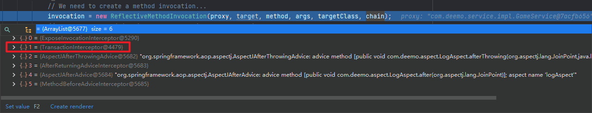

# Albrus - Spring TX

> Understanding and learning of transaction manager in spring framework.

## 一、开启事务

1. 打开配置

   ```java
   @Configuration
   @EnableTransactionManagement
   public class App {...}
   ```

2. 添加 `PlatformTransactionManager`

   ```java
   // org.springframework.beans.factory.NoSuchBeanDefinitionException: 
   // No qualifying bean of type 'org.springframework.transaction.PlatformTransactionManager' available
   
   @Bean
   public PlatformTransactionManager platformTransactionManager(DataSource dataSource) {
       // org.springframework.jdbc.datasource.DataSourceTransactionManager
       return new DataSourceTransactionManager(dataSource);
   }
   ```

3. 使用事务

   ```java
   @Override
   @Transactional
   public boolean insert(String game, double price) {...}
   ```

## 二、事务原理

### 2.1 `@EnableTransactionManagement`

```java
@Import(TransactionManagementConfigurationSelector.class)
public @interface EnableTransactionManagement {

	/**
	 * Indicate whether subclass-based (CGLIB) proxies are to be created ({@code true}) as
	 * opposed to standard Java interface-based proxies ({@code false}). The default is
	 * {@code false}. <strong>Applicable only if {@link #mode()} is set to
	 * {@link AdviceMode#PROXY}</strong>.
	 * <p>Note that setting this attribute to {@code true} will affect <em>all</em>
	 * Spring-managed beans requiring proxying, not just those marked with
	 * {@code @Transactional}. For example, other beans marked with Spring's
	 * {@code @Async} annotation will be upgraded to subclass proxying at the same
	 * time. This approach has no negative impact in practice unless one is explicitly
	 * expecting one type of proxy vs another, e.g. in tests.
	 */
	boolean proxyTargetClass() default false;

	/**
	 * Indicate how transactional advice should be applied.
	 * <p><b>The default is {@link AdviceMode#PROXY}.</b>
	 * Please note that proxy mode allows for interception of calls through the proxy
	 * only. Local calls within the same class cannot get intercepted that way; an
	 * {@link Transactional} annotation on such a method within a local call will be
	 * ignored since Spring's interceptor does not even kick in for such a runtime
	 * scenario. For a more advanced mode of interception, consider switching this to
	 * {@link AdviceMode#ASPECTJ}.
	 */
    // AdviceMode 默认是 PROXY
	AdviceMode mode() default AdviceMode.PROXY;

	/**
	 * Indicate the ordering of the execution of the transaction advisor
	 * when multiple advices are applied at a specific joinpoint.
	 * <p>The default is {@link Ordered#LOWEST_PRECEDENCE}.
	 */
	int order() default Ordered.LOWEST_PRECEDENCE;

}
```

- 可以看到，该注解导入了一个 `TransactionManagementConfigurationSelector`
- 该注解包含一个 `mode()` 属性，默认值是 `PROXY`

### 2.2 `TransactionManagementConfigurationSelector`

1. 该 `Selector` 继承关系

   ```java
   TransactionManagementConfigurationSelector
       -> extends AdviceModeImportSelector<EnableTransactionManagement>
           -> implements ImportSelector
   ```

2. `ImportSelector` 老面孔

   ```java
   // org.springframework.context.annotation.ImportSelector
   public interface ImportSelector {
   	/**
   	 * Select and return the names of which class(es) should be imported based on
   	 * the {@link AnnotationMetadata} of the importing @{@link Configuration} class.
   	 */
   	String[] selectImports(AnnotationMetadata importingClassMetadata);
   }
   ```

3. `AdviceModeImportSelector`

   ```java
   // org.springframework.context.annotation.AdviceModeImportSelector
   public abstract class AdviceModeImportSelector<A extends Annotation> implements ImportSelector {
       protected abstract String[] selectImports(AdviceMode adviceMode);
       
       @Override
   	public final String[] selectImports(AnnotationMetadata importingClassMetadata) {
           // ...
       }
   }
   ```

   - 提供一个抽象方法供子类实现：`String[] selectImports(AdviceMode adviceMode);`

   - 实现 `ImportSelector` 的 `String[] selectImports(AnnotationMetadata importingClassMetadata)` 接口

     ```java
     // org.springframework.context.annotation.AdviceModeImportSelector#selectImports(org.springframework.core.type.AnnotationMetadata)
     public final String[] selectImports(AnnotationMetadata importingClassMetadata) {
         // 1. 获取注解的类型：@EnableTransactionManagement
         Class<?> annType = GenericTypeResolver.resolveTypeArgument(getClass(), AdviceModeImportSelector.class);
     
         // 2. 获取注解中的属性
         AnnotationAttributes attributes = AnnotationConfigUtils.attributesFor(importingClassMetadata, annType);
         if (attributes == null) {
             throw new IllegalArgumentException(...);
         }
     
         // 获取注解中的 mode 属性
         AdviceMode adviceMode = attributes.getEnum("mode");
         // 调用抽象方法获取要导入的组件
         String[] imports = selectImports(adviceMode);
         if (imports == null) {
             throw new IllegalArgumentException("Unknown AdviceMode: " + adviceMode);
         }
         return imports;
     }
     ```

     1. 该注解类型在继承时已经标注了：`extends AdviceModeImportSelector<EnableTransactionManagement>`
     2. 获取 `@EnableTransactionManagement` 中的所有属性
     3. 获取注解中的 `mode` 属性值，前文提到过，默认值为：`PROXY`
     4. 调用抽象方法获取要导入的组件

4. `AdviceModeImportSelector<A extends Annotation>#String[] selectImports(AdviceMode adviceMode)`

   ```java
   // org.springframework.transaction.annotation.TransactionManagementConfigurationSelector#selectImports
   @Override
   protected String[] selectImports(AdviceMode adviceMode) {
       switch (adviceMode) {
           case PROXY:
               return new String[] {AutoProxyRegistrar.class.getName(),
                                    ProxyTransactionManagementConfiguration.class.getName()};
           case ASPECTJ:
               return new String[] {determineTransactionAspectClass()};
           default:
               return null;
       }
   }
   ```

   可以看到，当 `mode` 为 `PROXY` 时，为容器导入了 `AutoProxyRegistrar` 和 `ProxyTransactionManagementConfiguration` 两个组件。

### 2.3 组件一：`AutoProxyRegistrar`

```java
public class AutoProxyRegistrar implements ImportBeanDefinitionRegistrar {
    @Override
	public void registerBeanDefinitions(AnnotationMetadata importingClassMetadata, BeanDefinitionRegistry registry) {
        Object mode = candidate.get("mode");
        Object proxyTargetClass = candidate.get("proxyTargetClass");
        if (mode != null && proxyTargetClass != null && AdviceMode.class == mode.getClass() &&
            Boolean.class == proxyTargetClass.getClass()) {
            candidateFound = true;
            if (mode == AdviceMode.PROXY) {
                // PROXY 模式下
                AopConfigUtils.registerAutoProxyCreatorIfNecessary(registry);
                if ((Boolean) proxyTargetClass) {
                    AopConfigUtils.forceAutoProxyCreatorToUseClassProxying(registry);
                    return;
                }
            }
        }
    }
}
```

- 是一个 `ImportBeanDefinitionRegistrar`

- 同样也是获取注解的 `mode` 属性，也获取 `proxyTargetClass` 属性

- 当在 `PROXY` 模式下是，注册另外一个组件：`InfrastructureAdvisorAutoProxyCreator`

  ```java
  // org.springframework.aop.config.AopConfigUtils#registerAutoProxyCreatorIfNecessary
  @Nullable
  public static BeanDefinition registerAutoProxyCreatorIfNecessary(
      BeanDefinitionRegistry registry, @Nullable Object source) {
  
      return registerOrEscalateApcAsRequired(InfrastructureAdvisorAutoProxyCreator.class, registry, source);
  }
  ```

- `proxyTargetClass` 默认是 `FALSE`，暂不分析

### 2.4 `InfrastructureAdvisorAutoProxyCreator`

```java
/**
 * Auto-proxy creator that considers infrastructure Advisor beans only,
 * ignoring any application-defined Advisors.
 *
 * @author Juergen Hoeller
 * @since 2.0.7
 */
@SuppressWarnings("serial")
public class InfrastructureAdvisorAutoProxyCreator extends AbstractAdvisorAutoProxyCreator {

	@Nullable
	private ConfigurableListableBeanFactory beanFactory;


	@Override
	protected void initBeanFactory(ConfigurableListableBeanFactory beanFactory) {
		super.initBeanFactory(beanFactory);
		this.beanFactory = beanFactory;
	}

    // 判断适不适合用此增强器
	@Override
	protected boolean isEligibleAdvisorBean(String beanName) {
		return (this.beanFactory != null && this.beanFactory.containsBeanDefinition(beanName) &&
				this.beanFactory.getBeanDefinition(beanName).getRole() == BeanDefinition.ROLE_INFRASTRUCTURE);
	}

}
```

- `InfrastructureAdvisorAutoProxyCreator` 是一个 `AbstractAdvisorAutoProxyCreator`，更上层就是 `SmartInstantiationAwareBeanPostProcessor`，也就跟AOP更能很类似了

- 在上节分析AOP时在 `AopConfigUtils` 中：

  ```java
  private static final List<Class<?>> APC_PRIORITY_LIST = new ArrayList<>(3);
  static {
      // Set up the escalation list...
      APC_PRIORITY_LIST.add(InfrastructureAdvisorAutoProxyCreator.class);
      APC_PRIORITY_LIST.add(AspectJAwareAdvisorAutoProxyCreator.class);
      APC_PRIORITY_LIST.add(AnnotationAwareAspectJAutoProxyCreator.class);
  }
  ```

  赫然发现，`InfrastructureAdvisorAutoProxyCreator` 便是其中一员

- `InfrastructureAdvisorAutoProxyCreator` 功能便是

  - ==利用后置处理器机制在对象创建以后，包装对象（`wrapIfNecessary`），返回一个代理对象==

  - ==通过代理对象，获取拦截器链执行目标方法==

  - ==判断适不适合用此增强器：==

    `wrapIfNecessary -> getAdvicesAndAdvisorsForBean -> findEligibleAdvisors`

    ```java
    // org.springframework.aop.framework.autoproxy.AbstractAdvisorAutoProxyCreator#findEligibleAdvisors
    protected List<Advisor> findEligibleAdvisors(Class<?> beanClass, String beanName) {
        // 找到所有的增强器，里面便会触发 isEligibleAdvisorBean 接口
        List<Advisor> candidateAdvisors = findCandidateAdvisors();
        // 找到所有适合这个 Bean 的增强器
        List<Advisor> eligibleAdvisors = findAdvisorsThatCanApply(candidateAdvisors, beanClass, beanName);
        extendAdvisors(eligibleAdvisors);
        if (!eligibleAdvisors.isEmpty()) {
            eligibleAdvisors = sortAdvisors(eligibleAdvisors);
        }
        return eligibleAdvisors;
    }
    
    // 找增强器
    protected boolean isEligibleAdvisorBean(String beanName) {
        return (this.beanFactory != null && this.beanFactory.containsBeanDefinition(beanName) &&
                this.beanFactory.getBeanDefinition(beanName).getRole() == BeanDefinition.ROLE_INFRASTRUCTURE);
    }
    ```

    `BeanDefinition(beanName).getRole() == BeanDefinition.ROLE_INFRASTRUCTURE`：

    ```java
    /**
     * Role hint indicating that a {@code BeanDefinition} is providing an
     * entirely background role and has no relevance to the end-user. This hint is
     * used when registering beans that are completely part of the internal workings
     * of a {@link org.springframework.beans.factory.parsing.ComponentDefinition}.
     */
    int ROLE_INFRASTRUCTURE = 2;
    ```

    其中 `org.springframework.transaction.config.internalTransactionAdvisor` 的 role 便是 2

### 2.4 组件二：`ProxyTransactionManagementConfiguration`

给容器中添加了三个Bean

1. `BeanFactoryTransactionAttributeSourceAdvisor`

   ```java
   @Bean(name = TransactionManagementConfigUtils.TRANSACTION_ADVISOR_BEAN_NAME)
   @Role(BeanDefinition.ROLE_INFRASTRUCTURE)
   public BeanFactoryTransactionAttributeSourceAdvisor transactionAdvisor() {
       BeanFactoryTransactionAttributeSourceAdvisor advisor = new BeanFactoryTransactionAttributeSourceAdvisor();
       // 用于解析事务注解中的属性 `@Transactional`
       advisor.setTransactionAttributeSource(transactionAttributeSource());
       // `TransactionInterceptor` 事务拦截器
       advisor.setAdvice(transactionInterceptor());
       if (this.enableTx != null) {
           advisor.setOrder(this.enableTx.<Integer>getNumber("order"));
       }
       return advisor;
   }
   ```

   是一个 `BeanFactoryAware` 类型的增强器，负责注册后面两个组件：

   ```java
   BeanFactoryTransactionAttributeSourceAdvisor 
       -> extends AbstractBeanFactoryPointcutAdvisor
           -> extends AbstractPointcutAdvisor 
               -> implements BeanFactoryAware
       
   public class BeanFactoryTransactionAttributeSourceAdvisor extends AbstractBeanFactoryPointcutAdvisor {
       @Nullable
       private TransactionAttributeSource transactionAttributeSource;
   
       private final TransactionAttributeSourcePointcut pointcut = new TransactionAttributeSourcePointcut() {
           @Override
           @Nullable
           protected TransactionAttributeSource getTransactionAttributeSource() {
               return transactionAttributeSource;
           }
       };
   }
   ```

   - ==`transactionAttributeSource` 将被注册为一个 AOP 切入点==
   - ==`transactionInterceptor` 将在 `AbstractPointcutAdvisor` 层以 `Advice advice` 注册到容器==

2. `AnnotationTransactionAttributeSource`

   用于解析事务注解中的属性 `@Transactional`

3. `TransactionInterceptor` 事务拦截器

   ```java
   @Bean
   @Role(BeanDefinition.ROLE_INFRASTRUCTURE)
   public TransactionInterceptor transactionInterceptor() {
       TransactionInterceptor interceptor = new TransactionInterceptor();
       interceptor.setTransactionAttributeSource(transactionAttributeSource());
       if (this.txManager != null) {
           interceptor.setTransactionManager(this.txManager);
       }
       return interceptor;
   }
   ```

   `TransactionInterceptor`：

   ```java
   public class TransactionInterceptor extends TransactionAspectSupport implements MethodInterceptor, Serializable {
       @Override
   	@Nullable
   	public Object invoke(MethodInvocation invocation) throws Throwable {
   		// Work out the target class: may be {@code null}.
   		// The TransactionAttributeSource should be passed the target class
   		// as well as the method, which may be from an interface.
   		Class<?> targetClass = (invocation.getThis() != null ? AopUtils.getTargetClass(invocation.getThis()) : null);
   
   		// Adapt to TransactionAspectSupport's invokeWithinTransaction...
   		return invokeWithinTransaction(invocation.getMethod(), targetClass, invocation::proceed);
   	}
   }
   ```

   - 底层其实是一个 `MethodInterceptor`
   - 通过AOP章节可以知道，`MethodInterceptor` 最终会组成一个拦截器链拦截调用目标方法

   - `TransactionAspectSupport#invokeWithinTransaction`

     ```java
     // If the transaction attribute is null, the method is non-transactional.
     TransactionAttributeSource tas = getTransactionAttributeSource();
     final TransactionAttribute txAttr = (tas != null ? tas.getTransactionAttribute(method, targetClass) : null);
     // 获取 PlatformTransactionManager
     final PlatformTransactionManager tm = determineTransactionManager(txAttr);
     final String joinpointIdentification = methodIdentification(method, targetClass, txAttr);
     
     if (txAttr == null || !(tm instanceof CallbackPreferringPlatformTransactionManager)) {
         // Standard transaction demarcation with getTransaction and commit/rollback calls.
         // 开启事务
         TransactionInfo txInfo = createTransactionIfNecessary(tm, txAttr, joinpointIdentification);
         Object retVal = null;
         try {
             // This is an around advice: Invoke the next interceptor in the chain.
             // This will normally result in a target object being invoked.
             // 执行目标方法
             retVal = invocation.proceedWithInvocation();
         }
         catch (Throwable ex) {
             // target invocation exception
             // 异常时处理（回滚与提交）
             completeTransactionAfterThrowing(txInfo, ex);
             throw ex;
         }
         finally {
             cleanupTransactionInfo(txInfo);
         }
         // 正常时，提交事务
         commitTransactionAfterReturning(txInfo);
         return retVal;
     }
     ```

     - 获取 `PlatformTransactionManager`，可在注解 `@Transactional` 中指定

       没指定的情况下，从容器中按类型获取 `PlatformTransactionManager`

     - 开启事务

     - 执行目标方法

     - 如果异常，回滚与提交

     - 如果正常，提交事务

     - `finally` 清空事务

## 三、扩展

### 3.1 当 TX 遇到 AOP

当 TX 遇到 AOP，此时拦截器链：可以看到，此时 TX 的 `MethodInterceptor` 在拦截器链的最顶层。

### 3.2 哪种异常不会滚？

在 `TransactionInterceptor` 中有这样一段逻辑：

```java
// org.springframework.transaction.interceptor.TransactionAspectSupport#invokeWithinTransaction
try {
    // This is an around advice: Invoke the next interceptor in the chain.
    // This will normally result in a target object being invoked.
    retVal = invocation.proceedWithInvocation();
}
catch (Throwable ex) {
    // target invocation exception
    completeTransactionAfterThrowing(txInfo, ex);
    throw ex;
}
```

异常时，将会进入 `completeTransactionAfterThrowing(txInfo, ex);` 逻辑决定异常时的处理方案：

```java
// org.springframework.transaction.interceptor.TransactionAspectSupport#completeTransactionAfterThrowing
protected void completeTransactionAfterThrowing(@Nullable TransactionInfo txInfo, Throwable ex) {
    if (txInfo != null && txInfo.getTransactionStatus() != null) {
        // 决定该异常是否需要回滚
        if (txInfo.transactionAttribute != null && txInfo.transactionAttribute.rollbackOn(ex)) {
            try {
                txInfo.getTransactionManager().rollback(txInfo.getTransactionStatus());
            }
            catch (TransactionSystemException ex2) {
                logger.error("Application exception overridden by rollback exception", ex);
                ex2.initApplicationException(ex);
                throw ex2;
            }
            catch (RuntimeException | Error ex2) {
                logger.error("Application exception overridden by rollback exception", ex);
                throw ex2;
            }
        }
        else {
            // We don't roll back on this exception.
            // Will still roll back if TransactionStatus.isRollbackOnly() is true.
            // 不需要回滚
            try {
                txInfo.getTransactionManager().commit(txInfo.getTransactionStatus());
            }
            catch (TransactionSystemException ex2) {
                logger.error("Application exception overridden by commit exception", ex);
                ex2.initApplicationException(ex);
                throw ex2;
            }
            catch (RuntimeException | Error ex2) {
                logger.error("Application exception overridden by commit exception", ex);
                throw ex2;
            }
        }
    }
}
```

1. 可以看到，在 `if` 中有对异常的判断：`txInfo.transactionAttribute.rollbackOn(ex)`

   在最上层，有这样一段逻辑：

   ```java
   public boolean rollbackOn(Throwable ex) {
       return (ex instanceof RuntimeException || ex instanceof Error);
   }
   ```

   ==由此可见，`RuntimeException` 和 `Error` 类型的异常，才会回滚事务！==

2. 当返回 `TRUE` 时，需要回滚

3. 当返回 `FALUE` 时，将会提交事务
