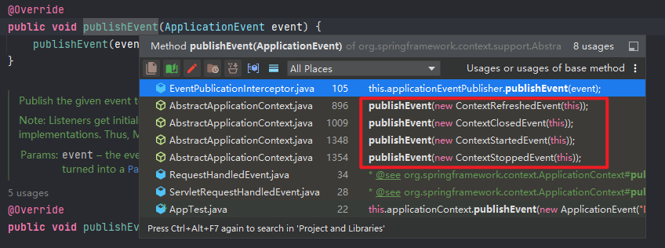

# Albrus - Spring Extra

> Understanding and learning of extra in spring framework.

## 一、BeanFactoryPostProcessor

### 1.1 是什么？

```java
@FunctionalInterface
public interface BeanFactoryPostProcessor {

	/**
	 * Modify the application context's internal bean factory after its standard
	 * initialization. All bean definitions will have been loaded, but no beans
	 * will have been instantiated yet. This allows for overriding or adding
	 * properties even to eager-initializing beans.
	 * @param beanFactory the bean factory used by the application context
	 * @throws org.springframework.beans.BeansException in case of errors
	 */
	void postProcessBeanFactory(ConfigurableListableBeanFactory beanFactory) throws BeansException;

}
```

在Bean Factory被初始化后，所有的Bean定义被加载但还没创建实例时被调用，用于修改 `beanFactory`

### 1.2 执行时机

```java
// org.springframework.context.support.AbstractApplicationContext#refresh
@Override
public void refresh() throws BeansException, IllegalStateException {
    synchronized (this.startupShutdownMonitor) {
        // Prepare this context for refreshing.
        prepareRefresh();

        // Tell the subclass to refresh the internal bean factory.
        ConfigurableListableBeanFactory beanFactory = obtainFreshBeanFactory();

        // Prepare the bean factory for use in this context.
        prepareBeanFactory(beanFactory);

        try {
            // Allows post-processing of the bean factory in context subclasses.
            postProcessBeanFactory(beanFactory);

            // Invoke factory processors registered as beans in the context.
            // 调用 BeanFactoryPostProcessor
            invokeBeanFactoryPostProcessors(beanFactory);

            // Register bean processors that intercept bean creation.
            registerBeanPostProcessors(beanFactory);

            // Initialize message source for this context.
            initMessageSource();

            // Initialize event multicaster for this context.
            initApplicationEventMulticaster();

            // Initialize other special beans in specific context subclasses.
            onRefresh();

            // Check for listener beans and register them.
            registerListeners();

            // Instantiate all remaining (non-lazy-init) singletons.
            finishBeanFactoryInitialization(beanFactory);

            // Last step: publish corresponding event.
            finishRefresh();
        }
    }
}
```

- 在 `invokeBeanFactoryPostProcessors(beanFactory);` 处执行 `BeanFactoryPostProcessor`
- 内部逻辑与 `registerBeanPostProcessors(beanFactory);` 很类似，也是获取到所有的 `BeanFactoryPostProcessor` 后，按 `PriorityOrdered > Ordered > non` 排序后执行，不再赘述 

## 二、BeanDefinitionRegistryPostProcessor

### 2.1 是什么？

```java
public interface BeanDefinitionRegistryPostProcessor extends BeanFactoryPostProcessor {

	/**
	 * Modify the application context's internal bean definition registry after its
	 * standard initialization. All regular bean definitions will have been loaded,
	 * but no beans will have been instantiated yet. This allows for adding further
	 * bean definitions before the next post-processing phase kicks in.
	 * @param registry the bean definition registry used by the application context
	 * @throws org.springframework.beans.BeansException in case of errors
	 */
	void postProcessBeanDefinitionRegistry(BeanDefinitionRegistry registry) throws BeansException;

}
```

可以看到，其实也是一个 `BeanFactoryPostProcessor`，是用来修改Bean注册中心的。

### 2.2 执行时机

```java
// org.springframework.context.support.AbstractApplicationContext#refresh
@Override
public void refresh() throws BeansException, IllegalStateException {
    synchronized (this.startupShutdownMonitor) {
        // Prepare this context for refreshing.
        prepareRefresh();

        // Tell the subclass to refresh the internal bean factory.
        ConfigurableListableBeanFactory beanFactory = obtainFreshBeanFactory();

        // Prepare the bean factory for use in this context.
        prepareBeanFactory(beanFactory);

        try {
            // Allows post-processing of the bean factory in context subclasses.
            postProcessBeanFactory(beanFactory);

            // Invoke factory processors registered as beans in the context.
            // 调用 BeanFactoryPostProcessor
            invokeBeanFactoryPostProcessors(beanFactory);
            
            // ...
        }
    }
}
```

- 也是在 `invokeBeanFactoryPostProcessors(beanFactory);` 阶段执行
- 但是是在 `BeanFactoryPostProcessor` 执行之前被执行
- 并且 `BeanDefinitionRegistryPostProcessor` 中实现的 `BeanFactoryPostProcessor` 接口方法将优先于普通的 `BeanFactoryPostProcessor` 执行，因为在执行完所有的 `BeanDefinitionRegistryPostProcessor.postProcessBeanDefinitionRegistry` 后会调用一次 `BeanDefinitionRegistryPostProcessor.postProcessBeanFactory`

==注意：在每次调用 `BeanDefinitionRegistryPostProcessor` 接口方法后，都会重写到容器中获取新的Bean定义信息，应该是为了加载这些后置处理器重新加载的Bean。==

## 三、ApplicationListener

> 监听容器中发布的事件。

### 3.1 监听事件

```java
@Slf4j
@Component
public class DeemoApplicationListener implements ApplicationListener<ApplicationContextEvent> {

    @Override
    public void onApplicationEvent(ApplicationContextEvent event) {
        log.info("receive event: {}.", event);
        System.out.println(event.getApplicationContext());
    }

}

// receive event: org.springframework.context.event.ContextRefreshedEvent[source=org.springframework.context.annotation.AnnotationConfigApplicationContext@1151e434, started on Sat Apr 23 13:42:50 CST 2022].
// receive event: org.springframework.context.event.ContextClosedEvent[source=org.springframework.context.annotation.AnnotationConfigApplicationContext@1151e434, started on Sat Apr 23 13:42:50 CST 2022].
```

### 3.2 发布自定义事件

```java
this.applicationContext.publishEvent(new ApplicationEvent("Deemo event") {});
```

### 3.3 执行时机

```java
// org.springframework.context.support.AbstractApplicationContext#refresh
@Override
public void refresh() throws BeansException, IllegalStateException {
    synchronized (this.startupShutdownMonitor) {
        // Prepare this context for refreshing.
        prepareRefresh();

        // Tell the subclass to refresh the internal bean factory.
        ConfigurableListableBeanFactory beanFactory = obtainFreshBeanFactory();

        // Prepare the bean factory for use in this context.
        prepareBeanFactory(beanFactory);

        try {
            // Allows post-processing of the bean factory in context subclasses.
            postProcessBeanFactory(beanFactory);

            // Invoke factory processors registered as beans in the context.
            invokeBeanFactoryPostProcessors(beanFactory);

            // Register bean processors that intercept bean creation.
            registerBeanPostProcessors(beanFactory);

            // Initialize message source for this context.
            initMessageSource();

            // Initialize event multicaster for this context.
            // 初始化多播器
            initApplicationEventMulticaster();

            // Initialize other special beans in specific context subclasses.
            onRefresh();

            // Check for listener beans and register them.
            // 注册 ApplicationListener
            registerListeners();

            // Instantiate all remaining (non-lazy-init) singletons.
            finishBeanFactoryInitialization(beanFactory);

            // Last step: publish corresponding event.
            // 完成容器刷新阶段
            finishRefresh();
        }
    }
}

// org.springframework.context.support.AbstractApplicationContext#finishRefresh
protected void finishRefresh() {
    // Clear context-level resource caches (such as ASM metadata from scanning).
    clearResourceCaches();

    // Initialize lifecycle processor for this context.
    initLifecycleProcessor();

    // Propagate refresh to lifecycle processor first.
    getLifecycleProcessor().onRefresh();

    // Publish the final event.
    // 发布事件
    publishEvent(new ContextRefreshedEvent(this));

    // Participate in LiveBeansView MBean, if active.
    LiveBeansView.registerApplicationContext(this);
}
```

- 在完成容器刷新的最后一步 `finishRefresh();` 中，==发布事件调用：`publishEvent(new ContextRefreshedEvent(this));`，发布的便是一个 `ContextRefreshedEvent` 事件==

- `publishEvent` 

  ```java
  // org.springframework.context.support.AbstractApplicationContext#publishEvent
  protected void publishEvent(Object event, @Nullable ResolvableType eventType) {
      Assert.notNull(event, "Event must not be null");
  
      // Decorate event as an ApplicationEvent if necessary
      ApplicationEvent applicationEvent;
      if (event instanceof ApplicationEvent) {
          applicationEvent = (ApplicationEvent) event;
      }
      else {
          applicationEvent = new PayloadApplicationEvent<>(this, event);
          if (eventType == null) {
              eventType = ((PayloadApplicationEvent<?>) applicationEvent).getResolvableType();
          }
      }
  
      // Multicast right now if possible - or lazily once the multicaster is initialized
      if (this.earlyApplicationEvents != null) {
          this.earlyApplicationEvents.add(applicationEvent);
      }
      else {
          // 获取多播器，发布事件
          getApplicationEventMulticaster().multicastEvent(applicationEvent, eventType);
      }
  
      // Publish event via parent context as well...
      if (this.parent != null) {
          if (this.parent instanceof AbstractApplicationContext) {
              ((AbstractApplicationContext) this.parent).publishEvent(event, eventType);
          }
          else {
              this.parent.publishEvent(event);
          }
      }
  }
  ```

  - 获取事件多播器 `getApplicationEventMulticaster()` -> `SimpleApplicationEventMulticaster`

- 多播事件 `multicastEvent(applicationEvent, eventType)`

  ```java
  // org.springframework.context.event.SimpleApplicationEventMulticaster#multicastEvent
  public void multicastEvent(final ApplicationEvent event, @Nullable ResolvableType eventType) {
      ResolvableType type = (eventType != null ? eventType : resolveDefaultEventType(event));
      // 获取所有的 ApplicationListener
      for (final ApplicationListener<?> listener : getApplicationListeners(event, type)) {
          Executor executor = getTaskExecutor();
          if (executor != null) {
              // 有 Executor 便异步执行
              executor.execute(() -> invokeListener(listener, event));
          }
          else {
              // 否则同步执行
              invokeListener(listener, event);
          }
      }
  }
  ```

  - 获取所有的 `ApplicationListener`：`getApplicationListeners(event, type)`

    根据 `ApplicationListener` 声明时的泛型决定是否匹配当前事件。

  - 有 `Executor` 便异步执行，否则同步执行，默认情况下没有 `Executor` -> `invokeListener(listener, event);`

- `invokeListener(listener, event);`

  ```java
  // org.springframework.context.event.SimpleApplicationEventMulticaster#invokeListener
  /**
   * Invoke the given listener with the given event.
   * @param listener the ApplicationListener to invoke
   * @param event the current event to propagate
   * @since 4.1
   */
  protected void invokeListener(ApplicationListener<?> listener, ApplicationEvent event) {
      ErrorHandler errorHandler = getErrorHandler();
      if (errorHandler != null) {
          // 有错误处理器
          try {
              doInvokeListener(listener, event);
          }
          catch (Throwable err) {
              errorHandler.handleError(err);
          }
      }
      else {
          // 没有错误处理器的时候
          doInvokeListener(listener, event);
      }
  }
  
  // org.springframework.context.event.SimpleApplicationEventMulticaster#doInvokeListener
  private void doInvokeListener(ApplicationListener listener, ApplicationEvent event) {
      // 触发接口方法
      listener.onApplicationEvent(event);
  }
  ```

- 发布自定义事件

  ```java
  // org.springframework.context.support.AbstractApplicationContext#publishEvent
  /**
   * Publish the given event to all listeners.
   * <p>Note: Listeners get initialized after the MessageSource, to be able
   * to access it within listener implementations. Thus, MessageSource
   * implementations cannot publish events.
   * @param event the event to publish (may be application-specific or a
   * standard framework event)
   */
  @Override
  public void publishEvent(ApplicationEvent event) {
      publishEvent(event, null);
  }
  
  protected void publishEvent(Object event, @Nullable ResolvableType eventType) {...}
  ```

  发布事件时，==调用的便是在完成容器刷新的最后一步 `finishRefresh();` 中调用的是同一个接口==，只是事件是自定义的事件，不再赘述。

- 内置事件

  

- 结束

### 3.4 额外补充：多播器

- 获取多播器：`getApplicationEventMulticaster()`

  ```java
  // org.springframework.context.support.AbstractApplicationContext#getApplicationEventMulticaster
  ApplicationEventMulticaster getApplicationEventMulticaster() throws IllegalStateException {
      return this.applicationEventMulticaster;
  }
  ```

- 属性 `AbstractApplicationContext.applicationEventMulticaster` 是什么时候被赋值的？

  ```java
  // org.springframework.context.support.AbstractApplicationContext#refresh
  @Override
  public void refresh() throws BeansException, IllegalStateException {
      synchronized (this.startupShutdownMonitor) {
          // Prepare this context for refreshing.
          prepareRefresh();
  
          // Tell the subclass to refresh the internal bean factory.
          ConfigurableListableBeanFactory beanFactory = obtainFreshBeanFactory();
  
          // Prepare the bean factory for use in this context.
          prepareBeanFactory(beanFactory);
  
          try {
              // Allows post-processing of the bean factory in context subclasses.
              postProcessBeanFactory(beanFactory);
  
              // Invoke factory processors registered as beans in the context.
              invokeBeanFactoryPostProcessors(beanFactory);
  
              // Register bean processors that intercept bean creation.
              registerBeanPostProcessors(beanFactory);
  
              // Initialize message source for this context.
              initMessageSource();
  
              // Initialize event multicaster for this context.
              // 初始化多播器
              initApplicationEventMulticaster();
  
              // Initialize other special beans in specific context subclasses.
              onRefresh();
  
              // Check for listener beans and register them.
              registerListeners();
  
              // Instantiate all remaining (non-lazy-init) singletons.
              finishBeanFactoryInitialization(beanFactory);
  
              // Last step: publish corresponding event.
              // 完成容器刷新阶段
              finishRefresh();
          }
      }
  }
  ```

- `initApplicationEventMulticaster();`

  ```java
  // org.springframework.context.support.AbstractApplicationContext#initApplicationEventMulticaster
  /**
   * Initialize the ApplicationEventMulticaster.
   * Uses SimpleApplicationEventMulticaster if none defined in the context.
   * @see org.springframework.context.event.SimpleApplicationEventMulticaster
   */
  protected void initApplicationEventMulticaster() {
      ConfigurableListableBeanFactory beanFactory = getBeanFactory();
      if (beanFactory.containsLocalBean(APPLICATION_EVENT_MULTICASTER_BEAN_NAME)) {
          this.applicationEventMulticaster =
              beanFactory.getBean(APPLICATION_EVENT_MULTICASTER_BEAN_NAME, ApplicationEventMulticaster.class);
      }
      else {
          this.applicationEventMulticaster = new SimpleApplicationEventMulticaster(beanFactory);
          beanFactory.registerSingleton(APPLICATION_EVENT_MULTICASTER_BEAN_NAME, this.applicationEventMulticaster);
      }
  }
  ```

  - 先从容器中获取名为 `APPLICATION_EVENT_MULTICASTER_BEAN_NAME = "applicationEventMulticaster"` 的Bean对象
  - 获取到则返回
  - 获取不到则注入一个 `SimpleApplicationEventMulticaster`

### 3.5 注册 `ApplicationListener`

```java
// org.springframework.context.support.AbstractApplicationContext#refresh
@Override
public void refresh() throws BeansException, IllegalStateException {
    synchronized (this.startupShutdownMonitor) {
        // Prepare this context for refreshing.
        prepareRefresh();

        // Tell the subclass to refresh the internal bean factory.
        ConfigurableListableBeanFactory beanFactory = obtainFreshBeanFactory();

        // Prepare the bean factory for use in this context.
        prepareBeanFactory(beanFactory);

        try {
            // Allows post-processing of the bean factory in context subclasses.
            postProcessBeanFactory(beanFactory);

            // Invoke factory processors registered as beans in the context.
            invokeBeanFactoryPostProcessors(beanFactory);

            // Register bean processors that intercept bean creation.
            registerBeanPostProcessors(beanFactory);

            // Initialize message source for this context.
            initMessageSource();

            // Initialize event multicaster for this context.
            // 初始化多播器
            initApplicationEventMulticaster();

            // Initialize other special beans in specific context subclasses.
            onRefresh();

            // Check for listener beans and register them.
            // 注册 ApplicationListener
            registerListeners();

            // Instantiate all remaining (non-lazy-init) singletons.
            finishBeanFactoryInitialization(beanFactory);

            // Last step: publish corresponding event.
            // 完成容器刷新阶段
            finishRefresh();
        }
    }
}
```

- `registerListeners();` 中获取 `getBeanFactory().getBeanNamesForType(ApplicationListener.class, true, false);`

- 将 `ApplicationListener` 注册到多播器

  ```java
  for (String listenerBeanName : listenerBeanNames) {
      getApplicationEventMulticaster().addApplicationListenerBean(listenerBeanName);
  }
  ```

  ==可以看到，此时注册的仅仅是名称！那么是在什么时候传递的实例化对象呢？==

  便是通过一个后置处理器：`ApplicationListenerDetector` 在 `postProcessAfterInitialization` 阶段将Bean实例注册给多播器的。

### 3.6 `@EventListener `

也可以通过注解快速指定监听器业务：

```java
@Slf4j
@Service
public class DeemoListenerServiceImpl {

    @EventListener(classes = {ApplicationEvent.class})
    public void listener(ApplicationEvent event) {
        log.info("receive event: {}.", event);
    }

}
```

`@EventListener` 原理 -> `See Also: EventListenerMethodProcessor`：

```java
public class EventListenerMethodProcessor
		implements SmartInitializingSingleton, ApplicationContextAware, BeanFactoryPostProcessor {...}
```

- 是一个 `SmartInitializingSingleton` 实现类

  ```java
  public interface SmartInitializingSingleton {
  
  	/**
  	 * Invoked right at the end of the singleton pre-instantiation phase,
  	 * with a guarantee that all regular singleton beans have been created
  	 * already. {@link ListableBeanFactory#getBeansOfType} calls within
  	 * this method won't trigger accidental side effects during bootstrap.
  	 * <p><b>NOTE:</b> This callback won't be triggered for singleton beans
  	 * lazily initialized on demand after {@link BeanFactory} bootstrap,
  	 * and not for any other bean scope either. Carefully use it for beans
  	 * with the intended bootstrap semantics only.
  	 */
  	void afterSingletonsInstantiated();
  
  }
  ```

  ==在单例预实例化阶段结束时调用，保证已创建所有常规单例Bean。==

- 在 `finishBeanFactoryInitialization(beanFactory)` 阶段

  ```java
  // org.springframework.context.support.AbstractApplicationContext#finishBeanFactoryInitialization
  protected void finishBeanFactoryInitialization(ConfigurableListableBeanFactory beanFactory) {
      // ...
      
      // Instantiate all remaining (non-lazy-init) singletons.
      beanFactory.preInstantiateSingletons();
  }
  
  ```

- `DefaultListableBeanFactory#preInstantiateSingletons`

  ```java
  // org.springframework.beans.factory.support.DefaultListableBeanFactory#preInstantiateSingletons
  public void preInstantiateSingletons() throws BeansException {
      // 创建所有单实例Bean
      // getBean(beanName); ...
      
      // Trigger post-initialization callback for all applicable beans...
      for (String beanName : beanNames) {
          Object singletonInstance = getSingleton(beanName);
          if (singletonInstance instanceof SmartInitializingSingleton) {
              final SmartInitializingSingleton smartSingleton = (SmartInitializingSingleton) singletonInstance;
              if (System.getSecurityManager() != null) {
                  AccessController.doPrivileged((PrivilegedAction<Object>) () -> {
                      smartSingleton.afterSingletonsInstantiated();
                      return null;
                  }, getAccessControlContext());
              }
              else {
                  smartSingleton.afterSingletonsInstantiated();
              }
          }
      }
  }
  ```

  ==在创建完所有单实例Bean后，还有一个 `beanNames` 的For循环，用于判断并执行 `SmartInitializingSingleton` 接口的 `afterSingletonsInstantiated()` 方法。==

- `EventListenerMethodProcessor.afterSingletonsInstantiated()`

  ```java
  // org.springframework.context.event.EventListenerMethodProcessor#afterSingletonsInstantiated
  String[] beanNames = beanFactory.getBeanNamesForType(Object.class);
  for (String beanName : beanNames) {
      Map<Method, EventListener> annotatedMethods = null;
      try {
          annotatedMethods = MethodIntrospector.selectMethods(targetType,
  (MethodIntrospector.MetadataLookup<EventListener>) method ->
  AnnotatedElementUtils.findMergedAnnotation(method, EventListener.class));
      } catch(...) {...}
  }
  ```

  - 遍历所有的Bean对象，判断Bean对象是否有 `@EventListener` 注解标注的方法

  - 如果存在 `@EventListener` 标注的方法，为容器中注册一个 `ApplicationListener<?>` 对象，默认：`ApplicationListenerMethodAdapter`

    ```java
    // org.springframework.context.event.EventListenerMethodProcessor#processBean
    
    // 反射获取 @EventListener 标注的方法
    Method methodToUse = AopUtils.selectInvocableMethod(method, context.getType(beanName));
    // 创建 ApplicationListener<?> 对象
    ApplicationListener<?> applicationListener =
        factory.createApplicationListener(beanName, targetType, methodToUse);
    if (applicationListener instanceof ApplicationListenerMethodAdapter) {
        ((ApplicationListenerMethodAdapter) applicationListener).init(context, this.evaluator);
    }
    context.addApplicationListener(applicationListener);
    ```

- `ApplicationListenerMethodAdapter`

  ```java
  public class ApplicationListenerMethodAdapter
      -> implements GenericApplicationListener
          -> extends ApplicationListener<ApplicationEvent>, Ordered
  ```

  ==内部便是通过反射：`return this.method.invoke(bean, args);` 调用目标方法，值得学习！==


